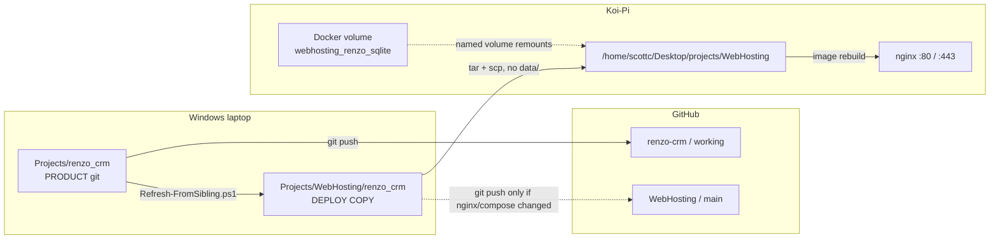
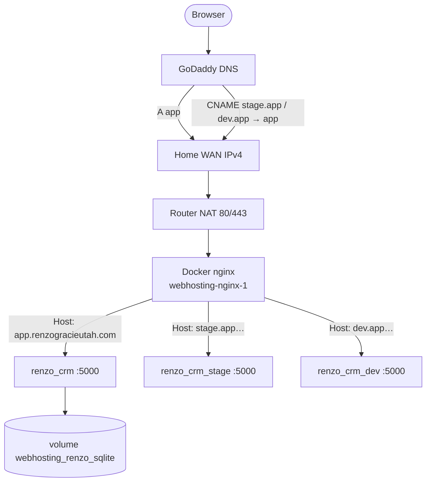
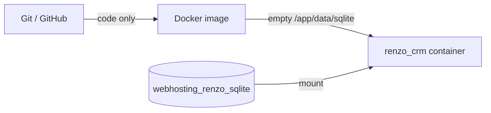
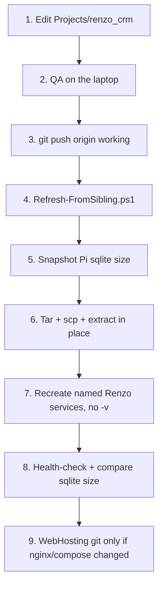

# Koi-Pi infrastructure and how we update it

This is the operator map for **Renzo on the Raspberry Pi**. Read it in Obsidian (outline, page preview, backlinks). Short loop: [[Deploy-Workflow]]. Live database: [[Operations-PRODUCTION-SQLite]]. Workspace map: [[Workspace]]. Durable choices: [[Decisions]].

Git-canonical twin: `WebHosting/vault/Operations/Koi-Pi-Infrastructure.md`

> [!danger] The one rule that cannot be bent
> PRODUCTION academy data lives in Docker volume `webhosting_renzo_sqlite`. It is **not** in Git, **not** in the image, and **not** in the laptop `data/` folder. Never `down -v`. Never prune volumes. Never copy a laptop `renzo.sqlite` onto the Pi.

## On this page

- [[#What this system is]]
- [[#Hardware]]
- [[#How the pieces connect]]
- [[#Laptop directories]]
- [[#Pi directories]]
- [[#Docker stack on Koi-Pi]]
- [[#DNS, TLS, and public names]]
- [[#Where the PRODUCTION database lives]]
- [[#What “push” actually means]]
- [[#The update loop]]
- [[#Forbidden actions]]
- [[#How to test from the house]]
- [[#Related notes]]

---

## What this system is

Renzo is a **guest** on an existing homelab stack. It does not own the Pi, nginx, or ports 80/443. Mori Combatives, Strategic Insights (SIC), JCATS, and the other WebHosting sites were there first.

Three machines / roles matter:

| Role | What it is | What it is not |
| --- | --- | --- |
| Windows laptop | Where you write the app | Not the public website |
| Koi-Pi | Where the public site and the live SQLite file run | Not the product Git repo |
| GitHub | Backup of **code** | Not a backup of PRODUCTION data |



---

## Hardware

### Koi-Pi (the server)

| Fact | Value |
| --- | --- |
| Hostname | `Koi-Pi` |
| Architecture | `aarch64` (64-bit ARM) |
| SSH user | `scottc` |
| SSH port | `22` |
| LAN IPv4 | `192.168.0.13` |
| Project path | `/home/scottc/Desktop/projects/WebHosting` |
| Compose project name | `webhosting` (`-p webhosting`) |
| Edge process | Existing **Docker** nginx. Owns host **80** and **443**. |
| Laptop login key | `C:\Users\Scoy9\.ssh\id_ed25519_pi` |

```powershell
ssh -i "C:\Users\Scoy9\.ssh\id_ed25519_pi" -o BatchMode=yes scottc@192.168.0.13
```

> [!info] Public IPv4 can change
> CenturyLink / the home router can hand out a new WAN address after a power flicker. Last recorded value after the 2026-09-07 outage was `97.117.66.157`. If the public site dies for everyone off-LAN, check the current WAN IP and the GoDaddy `app` **A** record. Do not change nameservers. Do not touch `@` or `www`.

### Windows laptop (the workshop)

| Fact | Value |
| --- | --- |
| Cursor workspace | `C:\Users\Scoy9\Projects\` — **not** a Git repo. Do not `git init` here. |
| Product | `C:\Users\Scoy9\Projects\renzo_crm` |
| Hosting copy | `C:\Users\Scoy9\Projects\WebHosting` |
| Ops UI | `C:\Users\Scoy9\Projects\ThePond` |
| Has | `ssh`, `scp`, Git `tar.exe` at `C:\Program Files\Git\usr\bin\tar.exe` |
| Does not have | `rsync.exe` — do not treat Pond “full stack rsync” as the default Renzo path |

Laptop Docker (when you use it) is a **different world**:

| Laptop | Koi-Pi |
| --- | --- |
| `pnpm dev` → http://localhost:5030 | no `pnpm dev` |
| Compose overlays `:5000` / `:5010` / `:5020` | **no** Renzo host ports |
| Volume names like `renzo-prod-sqlite` | Volume names `webhosting_renzo_*` |
| `pnpm backup:*` | does **not** protect the Pi |

### Network edges you will hit

| Path | What happens |
| --- | --- |
| Off-LAN browser → `https://app.renzogracieutah.com` | Public DNS → Pi WAN IP → router NAT → `192.168.0.13:443` → nginx → `renzo_crm:5000` |
| LAN browser → that same public name | Often **times out** (NAT hairpin). This is not a down site. |
| LAN test that works | `curl --resolve app.renzogracieutah.com:443:192.168.0.13` or hosts-file to `192.168.0.13` |
| Pi itself | `curl --resolve …:443:127.0.0.1` |

---

## How the pieces connect



Renzo containers **listen on 5000 inside the `web` Docker network only**. They are `expose: ["5000"]`, not `ports:`. That is deliberate: SIC already owns host `:5000`, TTH uses `:5010`. If you publish Renzo on those laptop ports on the Pi, you collide with other sites.

---

## Laptop directories

```text
C:\Users\Scoy9\Projects\                         Cursor workspace. Not a Git repo.
│
├── renzo_crm\                                   PRODUCT. Remote: github.com/Koifish95/renzo-crm.git
│   │                                            Branch: working
│   ├── app\  server\  shared\  drizzle\         Application source
│   ├── vault\                                   This Obsidian vault
│   ├── data\                                    Laptop-only SQLite / uploads. NEVER sync to Pi.
│   ├── .env                                     Laptop secrets. NEVER copy to the drop-in.
│   └── AGENTS.md                                Product briefing
│
├── WebHosting\                                  PI RUNTIME. Remote: github.com/Koifish95/WebHosting.git
│   │                                            Branch: main. Often dirty with unrelated work.
│   ├── docker-compose.yml                       One Compose file for the whole Pi
│   ├── NGINX\
│   │   ├── nginx.conf                           Bind-mounted into the nginx container
│   │   ├── certs\                               Other sites’ manual PEMs
│   │   └── certbot\
│   │       ├── www\                             HTTP-01 webroot
│   │       ├── etc\                             Let's Encrypt state (gitignored)
│   │       ├── renew-and-reload.sh
│   │       ├── webhosting-renzo-certbot.service
│   │       └── webhosting-renzo-certbot.timer
│   ├── vault\Operations\                        Hosting twins of these notes
│   └── renzo_crm\                               DEPLOY COPY. No nested .git.
│       ├── Refresh-FromSibling.ps1              The only approved copy method
│       ├── README.md                            Drop-in rules (Refresh will not overwrite this)
│       ├── .env.production / .env.stage / .env.dev   Live secrets. Refresh will not overwrite.
│       └── (app source, no data/)
│
├── ThePond\                                     OPS TOOLING. Remote: ThePond / main
│   └── apps/ops-console + services/ops-api      “Ship to Pi” UI
│
└── vault\                                       Scott scratch notes. Not the product remote.
```

> [!warning] Two folders named `renzo_crm`
> `Projects\renzo_crm` is the product. `Projects\WebHosting\renzo_crm` is a **copy used to build the Pi image**. Edit the sibling. Refresh. Do not develop in the drop-in. Do not delete the sibling.

Open Cursor at `Projects\renzo_crm` for daily app work. Open `Projects` only when the task crosses remotes.

---

## Pi directories

```text
/home/scottc/Desktop/projects/WebHosting/
├── docker-compose.yml
├── NGINX/
│   ├── nginx.conf                 bind-mount → /etc/nginx/nginx.conf
│   ├── certs/
│   └── certbot/
│       ├── www/                   bind-mount → /var/www/certbot
│       └── etc/                   bind-mount → /etc/letsencrypt
│           └── live/renzo/        fullchain.pem, privkey.pem  (not in Git)
└── renzo_crm/
    ├── Dockerfile                 build context for image webhosting-renzo_crm
    ├── .env.production            used by service renzo_crm
    ├── .env.stage                 used by service renzo_crm_stage
    ├── .env.dev                   used by service renzo_crm_dev
    └── (application source)

Docker named volumes (not folders in the Git tree):

  webhosting_renzo_sqlite          → /app/data/sqlite   in renzo_crm
  webhosting_renzo_assets          → /app/data/uploads  in renzo_crm
  webhosting_renzo_sqlite_stage    → same paths in renzo_crm_stage
  webhosting_renzo_assets_stage
  webhosting_renzo_sqlite_dev
  webhosting_renzo_assets_dev
```

Inspect the live PRODUCTION file **without copying it off the volume**:

```bash
sudo ls -l /var/lib/docker/volumes/webhosting_renzo_sqlite/_data
docker exec webhosting-renzo_crm-1 ls -l /app/data/sqlite/
```

Record the **byte size** before a deploy. After recreate it should be the same file (size equal or slightly larger). An empty seed database is a few tens of KB, not hundreds of KB of academy data.

---

## Docker stack on Koi-Pi

Compose project: **`webhosting`**. File: `docker-compose.yml`. Start extras with `--profile optional`.

### Renzo services

| Compose service | Container | `APP_ENV` | Public Host | SQLite volume |
| --- | --- | --- | --- | --- |
| `renzo_crm` | `webhosting-renzo_crm-1` | `production` | `app.renzogracieutah.com` | `webhosting_renzo_sqlite` |
| `renzo_crm_stage` | `webhosting-renzo_crm_stage-1` | `stage` | `stage.app.renzogracieutah.com` | `webhosting_renzo_sqlite_stage` |
| `renzo_crm_dev` | `webhosting-renzo_crm_dev-1` | `dev` | `dev.app.renzogracieutah.com` | `webhosting_renzo_sqlite_dev` |

All three share image `webhosting-renzo_crm`. All three listen on **container** port 5000. All three `restart: unless-stopped`. Startup runs migrations, then seed, then the app. Seed is idempotent and must **not** replace the sqlite file. `NUXT_AUTH_RESET_PASSWORD=true` re-hashes passwords; it does not delete leads.

### Neighbors on the same Compose project

| Service | Host port / notes |
| --- | --- |
| `nginx` | **80** and **443** on the Pi |
| `web_prod` (SIC) | host `5000:5000` |
| `mori_combatives` | host `5004:80` |
| `toptier_hauling` | expose 5010 — do **not** start unless Scott asks |
| `jcats` | optional, host 5003 |
| `stillbeauty` | optional, host 5002 — 502 is pre-existing |
| `cloudflare_ddns` | other customers only. **Do not** add Renzo names to `DOMAINS=` |
| `certbot` | one-shot, `--profile optional` |

> [!warning] nginx bind-mount inode
> `NGINX/nginx.conf` is bind-mounted. An `scp` that *replaces the file inode* can be invisible to a running nginx until you `nginx -t` and `--force-recreate nginx`. Prefer editing **in place** on the Pi, then test, then recreate **nginx only**. Never recreate the whole stack to pick up a conf change.

---

## DNS, TLS, and public names

Locked. Do not reopen. See [[Decisions#2026-09-07 — Renzo DNS/TLS is GoDaddy + Let's Encrypt, not Cloudflare]].

| Name | Record | Destination |
| --- | --- | --- |
| `app.renzogracieutah.com` | GoDaddy **A** | Pi public IPv4 |
| `stage.app.renzogracieutah.com` | **CNAME** | `app.renzogracieutah.com` |
| `dev.app.renzogracieutah.com` | **CNAME** | `app.renzogracieutah.com` |
| `renzogracieutah.com` / `www` | leave alone | GoDaddy Website Builder |

No apex on Renzo. No `www` variants. No Cloudflare orange-cloud. No Caddy.

### Certificate

- Dockerized `certbot/certbot`, HTTP-01 webroot
- Cert **name:** `renzo`
- SANs: the three app names only
- On disk (Pi, gitignored): `/etc/letsencrypt/live/renzo/fullchain.pem` and `privkey.pem`
- HTTP `/.well-known/acme-challenge/` is **not** redirected
- Everything else on those vhosts **301 → HTTPS**
- systemd timer `webhosting-renzo-certbot.timer` at 03:17 and 15:17 local, runs `NGINX/certbot/renew-and-reload.sh`
- Issued 2026-09-07; expires **2026-12-06** unless renewed
- ACME email already on the account: the address recorded in the M10D handoff

Evidence: `WebHosting/vault/Operations/M10D_HTTPS_LetsEncrypt_NGINX_Handoff_2026-09-07.md`

---

## Where the PRODUCTION database lives

```text
Volume:     webhosting_renzo_sqlite
Host path:  /var/lib/docker/volumes/webhosting_renzo_sqlite/_data/renzo.sqlite
In app:     /app/data/sqlite/renzo.sqlite
Compose:    renzo_crm
URL:        https://app.renzogracieutah.com
```



A normal update **rebuilds the image and recreates the container**. The named volume remounts. The file stays.

Laptop `C:\Users\Scoy9\Projects\renzo_crm\data\renzo.sqlite` is a **different database**. Mixing them is a restore, not a deploy.

Full table of safe vs destructive actions: [[Operations-PRODUCTION-SQLite]].

---

## What “push” actually means

People say “push” for four different jobs. Only one of them is `git push`.

| Words | Action | Remote / target |
| --- | --- | --- |
| Push the app | `git commit` + `git push` in `Projects\renzo_crm` | `renzo-crm` branch `working` |
| Copy into WebHosting | `Refresh-FromSibling.ps1` | Laptop drop-in. **Not Git.** |
| Put it on the website | tar/scp to Koi-Pi + recreate named services | The Pi. **Not Git.** |
| Push hosting | `git commit` + `git push` of **named** WebHosting files | `WebHosting` branch `main` |

A UI or CRM change is **1 + 2 + 3**. Step 4 is rare.

The WebHosting Git tree is often dirty (Mori submodule, deleted nested ThePond, `.obsidian`, filled env, certs). Never stage that pile with a Renzo feature.

---

## The update loop

Do these in order. Do not skip the product Git save. Do not start at the drop-in.



### 1. Edit the product

Open Cursor at `C:\Users\Scoy9\Projects\renzo_crm`.

This is the only place application source is authoritative. If you find yourself editing `WebHosting\renzo_crm\app\…`, stop. Change the sibling and refresh again.

Local run (optional):

```powershell
cd C:\Users\Scoy9\Projects\renzo_crm
pnpm dev
```

App: http://localhost:5030 — never 3000 / 5000 / 5010 / 5020.

### 2. QA on the laptop

For a behavior change: `pnpm test`, `pnpm lint`, `pnpm typecheck`, `pnpm build`. Click the staff flow if the work was UI. API tests are not browser QA.

### 3. Save the product on GitHub **before** you copy

```powershell
cd C:\Users\Scoy9\Projects\renzo_crm
git status
git add -- <only the files for this work>
git commit
git push origin HEAD
```

Branch is `working`. This is the real save. GitHub is the backup of **code**.

Do not commit `.env`, `data/renzo.sqlite`, `data/uploads/`, `vault/.obsidian/`, or `vault/wip/` prompts unless you asked for that on purpose.

### 4. Refresh the drop-in (update, do not wipe)

```powershell
cd C:\Users\Scoy9\Projects\WebHosting\renzo_crm
powershell -NoProfile -File .\Refresh-FromSibling.ps1
```

`robocopy` copies from `C:\Users\Scoy9\Projects\renzo_crm` into the drop-in.

**Skipped directories:** `.git`, `node_modules`, `.nuxt`, `.output`, `.nitro`, `data`, `.obsidian`, coverage, logs, IDE folders.

**Skipped files:** drop-in `README.md`, `.env`, `.env.production`, `.env.stage`, `.env.dev`, `.env.local`, every `*.sqlite*`.

After refresh you should still see the drop-in’s own `.env.production` / `.env.stage` / `.env.dev`. There should be **no** `data\` folder in the drop-in.

Robocopy exit `0`–`7` is success. `8+` is failure.

> [!tip] After refresh, stop editing the drop-in
> The next change belongs in the sibling. Refresh again.

### 5. Snapshot PRODUCTION sqlite **before** you touch the Pi

```powershell
ssh -i "C:\Users\Scoy9\.ssh\id_ed25519_pi" -o BatchMode=yes scottc@192.168.0.13 "sudo ls -l /var/lib/docker/volumes/webhosting_renzo_sqlite/_data; curl -sk --resolve app.renzogracieutah.com:443:127.0.0.1 https://app.renzogracieutah.com/api/health; echo"
```

Write down:

- file size in bytes
- health JSON: `database: reachable`, `appEnv: production`

Optional extra caution until Pi backup/restore is proven: on PRODUCTION, ADMIN → Settings → Environment → download a zip. That zip is the recovery copy. Laptop `pnpm backup:prod` is **not** that copy.

### 6. Sync source to the Pi (exclude data and env)

**Allowed UI:** The Pond → Ops Console → Pi 1 → **Renzo** → **Ship to Pi**.

That button confirms, then auto-runs: push committed product `working` → refresh sibling → snapshot PRODUCTION sqlite size → tar `renzo_crm/` + `docker-compose.yml` (excludes `data/` and filled `.env*`) → extract **in place** → named recreate (no initial stop; old containers stay up until `--force-recreate`) → verify → compare sqlite size. **Preview push plan** is the advanced checkbox + Launch path.

Sqlite size is a sanity check. Protection is the named volume + tar excludes + never `down -v`.

**Do not** use `/host/pi-1/deploy` folder-rename presets (`full`, `renzo*`). Those are a different, higher-blast-radius path.

**Hand path** (what Cursor has been using; this laptop has no `rsync.exe`):

Create the archive from `C:\Users\Scoy9\Projects\WebHosting` with Git tar and `--force-local` (a `C:\…` path without that flag is treated as a remote host). Exclude the same list The Pond uses:

```text
renzo_crm/node_modules
renzo_crm/.nuxt
renzo_crm/.output
renzo_crm/.nitro
renzo_crm/data
renzo_crm/.git
renzo_crm/.obsidian
renzo_crm/coverage
renzo_crm/logs
renzo_crm/.idea
renzo_crm/.vscode
renzo_crm/README.md
renzo_crm/.env
renzo_crm/.env.production
renzo_crm/.env.stage
renzo_crm/.env.dev
renzo_crm/.env.local
renzo_crm/**/*.sqlite
renzo_crm/**/*.sqlite-wal
renzo_crm/**/*.sqlite-shm
renzo_crm/**/*.sqlite-journal
```

Include only:

```text
renzo_crm/
docker-compose.yml
```

List the archive. It must **not** contain live `.env.production` / `.env.stage` / `.env.dev`, any `renzo_crm/data/` path, or `*.sqlite`. Example env files (`*.example`) are allowed.

```powershell
scp -i "C:\Users\Scoy9\.ssh\id_ed25519_pi" -o BatchMode=yes `
  C:\Users\Scoy9\Projects\WebHosting\pond-renzo-tmp.tar `
  scottc@192.168.0.13:/tmp/pond-renzo-tmp.tar
```

On the Pi:

```bash
# Confirm archive has no live env / data / sqlite
tar tf /tmp/pond-renzo-tmp.tar | grep -E 'sqlite$|/data/|\.env.production$|\.env.stage$|\.env.dev$' || echo 'archive clean'

# Extract in place. Existing .env* stay because they are not in the tar.
tar xf /tmp/pond-renzo-tmp.tar -C /home/scottc/Desktop/projects/WebHosting
rm -f /tmp/pond-renzo-tmp.tar
```

Confirm after extract:

- `.env.production` / `.env.stage` / `.env.dev` still have the **same size and date** as before
- `NUXT_AUTH_RESET_PASSWORD=false` on all three (unless you meant to reset passwords)
- volume sqlite size unchanged
- delete the laptop `pond-renzo-tmp.tar` so it is not committed

### 7. Rebuild and recreate **named Renzo services only**

On the Pi:

```bash
cd /home/scottc/Desktop/projects/WebHosting
docker compose -p webhosting --profile optional up -d --build --no-deps \
  --force-recreate renzo_crm renzo_crm_stage renzo_crm_dev
```

What each flag means:

| Flag | Why |
| --- | --- |
| `-p webhosting` | The existing Compose project. Do not invent a second one. |
| `--profile optional` | Renzo services are optional guests. |
| `--build` | Rebuild image `webhosting-renzo_crm` from `./renzo_crm`. |
| `--no-deps` | Do not restart nginx, SIC, Mori, TTH. |
| `--force-recreate` | New container, **same named volumes**. |
| three service names | Only Renzo. Not `down`. |

Takes about one to two minutes on the Pi (Nuxt production build).

> [!danger] Never add `-v` here
> `down -v` deletes named volumes. That is how you lose PRODUCTION.

### 8. Prove PRODUCTION survived

Wait until healthchecks go green (~15–40 seconds), then:

```bash
docker compose -p webhosting ps
docker volume ls | grep webhosting_renzo
sudo ls -l /var/lib/docker/volumes/webhosting_renzo_sqlite/_data

curl -sk --resolve app.renzogracieutah.com:443:127.0.0.1 \
  https://app.renzogracieutah.com/api/health
```

Required:

- containers `renzo_crm`, `_stage`, `_dev` **healthy**
- all six `webhosting_renzo_*` volumes still listed
- sqlite **byte size matches the pre-deploy snapshot**
- JSON: `"ok":true`, `"database":"reachable"`, `"appEnv":"production"`
- `/login` returns 200
- a household you already entered is still in the UI

STAGE and DEV have their own volumes. They can be empty-ish. PRODUCTION is the one that must not shrink to a fresh seed.

### 9. WebHosting Git — only if hosting files changed

Commit WebHosting **only** for things like:

- `docker-compose.yml`
- `NGINX/nginx.conf`
- certbot scripts / systemd units
- drop-in `README.md` / `Refresh-FromSibling.ps1`
- `vault/Operations/*` host notes

A mobile UI change does **not** need this. The product remote already has the code.

ThePond gets its own commit only if probes, presets, `sync-excludes.txt`, or the in-place Renzo ops path changed.

---

## Forbidden actions

```text
docker compose -p webhosting down -v
docker volume rm webhosting_renzo_sqlite
docker volume prune
docker system prune --volumes
```

Also forbidden as a side effect of “just updating the site”:

- extracting a tarball that includes `renzo_crm/data/`
- `docker cp` of a laptop sqlite into `/app/data/sqlite/`
- `pnpm env:prod:load-local` aimed at the Pi
- treating laptop `pnpm backup:*` as a Pi backup
- Pond folder-rename deploy (`/host/pi-1/deploy`, presets `full` / `renzo*`)
- starting `toptier_hauling` “while we’re in there”
- continuing after `nginx -t` fails
- adding Renzo to Cloudflare or `cloudflare-ddns.env`
- changing GoDaddy nameservers or the `@` / `www` records
- `git init` at `C:\Users\Scoy9\Projects`
- putting a `.git` inside `WebHosting\renzo_crm`

If a deploy goes bad, roll back the **image / code**. Do not delete the volume to “start clean.”

---

## How to test from the house

> [!info] NAT hairpin
> From a laptop on the same LAN, `https://app.renzogracieutah.com` often hangs. That does not mean the Pi is down. Test off-LAN (phone on cellular) or force the LAN IP.

```powershell
curl.exe -sk --resolve app.renzogracieutah.com:443:192.168.0.13 `
  https://app.renzogracieutah.com/api/health
```

On the Pi:

```bash
curl -sk --resolve app.renzogracieutah.com:443:127.0.0.1 \
  https://app.renzogracieutah.com/api/health
```

Staff chrome on those hostnames uses hostname switching (no `:5000` links). Login on all three public envs is currently the pilot pair `admin` / `setup`. Change that before real staff use.

---

## Operator checklist

Use this when you are about to put a laptop change on the website. Dataview can pick these up from this note; they also read as a normal list.

- [ ] I edited `Projects\renzo_crm`, not the drop-in
- [ ] Product is committed and on `origin/working`
- [ ] I ran `Refresh-FromSibling.ps1` (env files still present, no `data\`)
- [ ] I recorded PRODUCTION sqlite **byte size**
- [ ] The sync archive contains no `data/`, no `*.sqlite*`, no filled `.env*`
- [ ] I will recreate **named Renzo services only**, with **no** `-v`
- [ ] Afterward: health `production` + `reachable`, sqlite size unchanged, a known record still exists
- [ ] I will not Git-push the whole WebHosting tree

---

## Related notes

| Note | Why |
| --- | --- |
| [[Workspace]] | Three remotes, locked host, hard stops |
| [[Deploy-Workflow]] | Short version of the loop |
| [[Operations-PRODUCTION-SQLite]] | Safe vs destructive table |
| [[How-to-Run]] | Laptop `pnpm` and laptop Docker |
| [[Architecture]] | App stack and public-edge shape |
| [[Implementation-State]] | What is live vs not started |
| [[Decisions]] | DNS/TLS, sibling-vs-drop-in, sqlite preservation |
| [[Home]] | Vault map |

Handoff evidence (not the map): `WebHosting/vault/Operations/M10D_HTTPS_LetsEncrypt_NGINX_Handoff_2026-09-07.md`, M10C closeout in the same folder.
