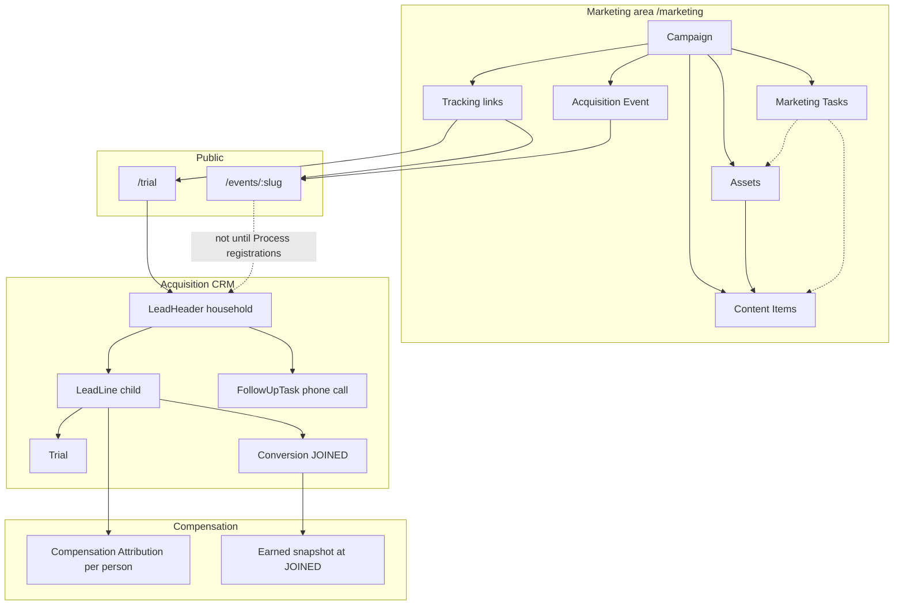
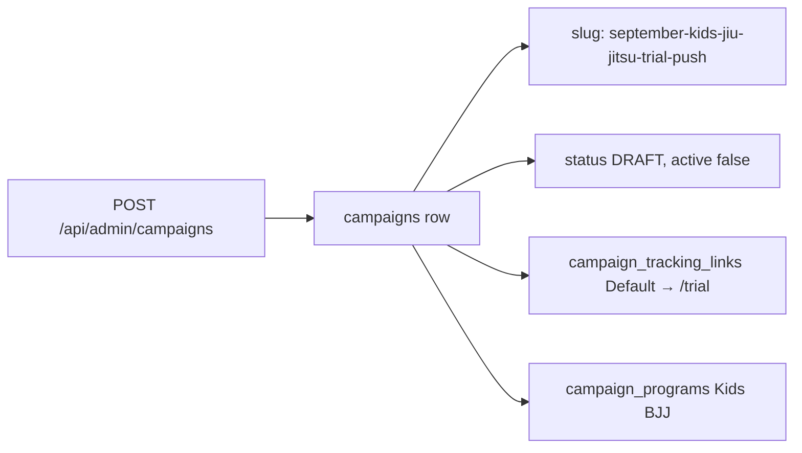
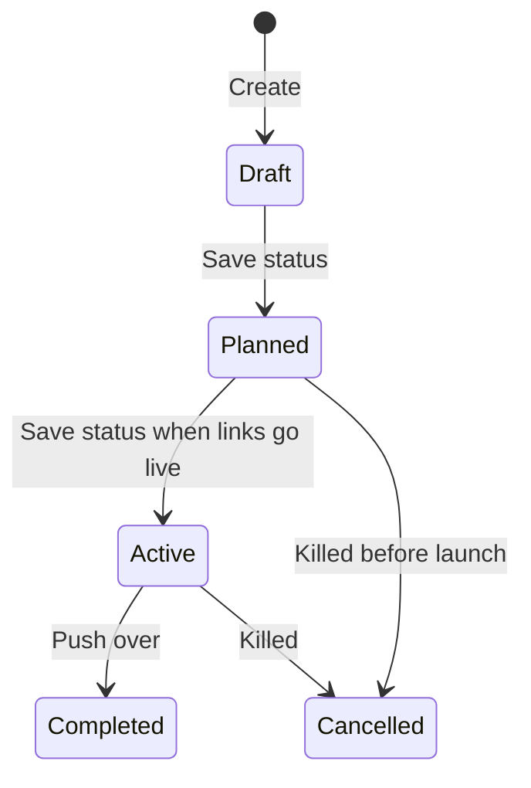
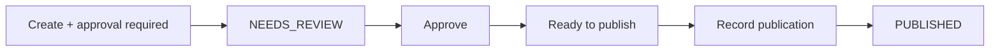
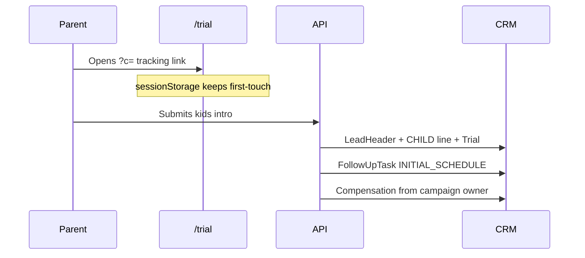

# Hands-on: September Kids Jiu-Jitsu Trial Push

Click-by-click walkthrough of **one mock Marketing Campaign** in the app as it exists on the M9 branch. Not marketing theory. Not invented screens.

Companion overview: [[wip/Renzo_Gracie_Kaysville_Marketing_Workflow_2026-09-03]]. Domain terms: [[Domain-Model]]. After a household exists: [[CRM]]. Evidence: [[wip/M9_Implementation_Handoff_2026-09-02]].

> [!abstract] What this campaign is
> Renzo Gracie Kaysville is pushing **Kids BJJ intro trials** for September 2026. Scott owns the campaign. Marta handles photos and captions. Pedro helps with in-gym flyers and (later) phone follow-up. Public destination is **`/trial`**, not an event, unless you take the optional open-house branch.

> [!warning] Do not invent screens
> This note only describes UI that exists. Where the **API can do something the page cannot**, it is called out in a red box. Those gaps are real.

---

## How to use this in Obsidian

1. Open the `vault/` folder as the vault.
2. Use the **Outline** pane to jump steps.
3. Check boxes as you complete them in the running app (`http://localhost:5000`).
4. Mermaid diagrams render in Reading view. Callouts (`[!tip]`, `[!warning]`) are native Obsidian.

```mermaid
flowchart LR
  A[1 Create campaign] --> B[2 Planning card]
  B --> C[3 Tracking links]
  C --> D[4 Marketing Tasks]
  D --> E[5 Assets]
  E --> F[6 Content + approval]
  F --> G[7 Optional event]
  G --> H[8 Activate + share]
  H --> I[9 Public /trial]
  I --> J[10 Follow-up + convert]
  J --> K[11 Reports + Meta]
  K --> L[12 Compensation]
```



---

## Who is who

The app does **not** seed Scott, Marta, or Pedro. Seed login is ADMIN:

| Role in this story | Sign in as | Access |
|---|---|---|
| **Scott** (campaign owner) | `admin` / `setup` | ADMIN. Every marketing right in code. |
| **Marta** (content + assets) | Only if you created her on `/users` | Intended: STAFF + content/asset roles |
| **Pedro** (events / floor) | Only if you created him on `/users` | Intended: STAFF + event roles |

> [!tip] If you only have Admin
> Assign **Owner** to `Admin`. Leave collaborators empty. Assign Marketing Tasks to `Admin` and pretend that person is Marta or Pedro. Creating extra users is optional and is **not** required for the mock to work.

Four different “credit” ideas. Mixing them is how the data lies later:

| Idea | Where it lives | What it is |
|---|---|---|
| **Campaign owner** | Campaign card | Planning owner. System uses this person as compensation credit when a tracked lead is created. |
| **Household source / campaign** | LeadHeader | First-touch acquisition. Tracking link + UTM. |
| **Follow-up assignee** | `/tasks` | Who is supposed to call the parent. Completing a call does **not** change compensation. |
| **Publisher** | Content Item | Who is supposed to hit Post on Instagram. Not the campaign owner. |

---

## How the objects connect

Marketing **feeds** acquisition. It does not replace Leads, Trials, Follow-up, or Join.



> [!note] Two public doors
> **`/trial`** creates a household immediately (guardian + child Trial).  
> **`/events/:slug`** creates a **roster row only**. Leads appear after staff clicks Preview → Process registrations.

---

## Get into the app

- [x] App running: `pnpm dev` → [http://localhost:5000](http://localhost:5000) ✅ 2026-09-03
- [x] Open [http://localhost:5000/login](http://localhost:5000/login) ✅ 2026-09-03
- [x] Username or email: `admin` (or `admin@local`) ✅ 2026-09-03
- [x] Password: `setup` ✅ 2026-09-03
- [x] After login you land on **Dashboard** (`/dashboard`) ✅ 2026-09-03

Navy rail, click **Marketing**. That is `/marketing`.

> [!example] What you should see on the hub
> Title: **Marketing**. Copy: *Command center for Campaign work. This is not the acquisition Dashboard.*
>
> Four tiles: Marketing Tasks, Content, Active Campaigns, Upcoming events. On a fresh DB they are zeros. A **Draft** campaign does **not** count as Active.
>
> Bottom grid: Campaigns, Tasks, Content, Assets, Events, Compensation.

You need ADMIN, or Access Right `VIEW_MARKETING`. ADMIN always has every right. A STAFF user with no marketing roles is bounced to Dashboard.

---

## Step 1 — Create the campaign record

**Screen:** `/marketing/campaigns`  
**Get there:** Marketing hub → **Active Campaigns** tile, or the **Campaigns** card at the bottom.

**What you are looking at:** Header says a Marketing Campaign is a **business initiative**, not a Meta Ads campaign. Top of the page is a two-column **create form**. Cards below are existing campaigns.

**What we are doing:** Create the hub record. Everything else hangs off this. Status stays **Draft**. Do not share the tracking link yet.

### Create form — enter this

| Field                        | Enter                                                                                                                                                                                      | What it controls                                                                                        |
| ---------------------------- | ------------------------------------------------------------------------------------------------------------------------------------------------------------------------------------------ | ------------------------------------------------------------------------------------------------------- |
| **Campaign name** (required) | `September Kids Jiu-Jitsu Trial Push`                                                                                                                                                      | Staff label everywhere this campaign is named.                                                          |
| **Kind**                     | `Paid`                                                                                                                                                                                     | Planning label only. **The edit card has no Kind control**, so pick it now. Does not create Meta ads.   |
| **Status**                   | `Draft`                                                                                                                                                                                    | Lifecycle. Draft keeps `active = false`, so public tracking will **not** stamp leads yet.               |
| **Planned budget USD**       | `250`                                                                                                                                                                                      | Stored as **25000 cents**. Internal plan, not Meta spend. `$0` is also valid.                           |
| **Primary channel**          | `Instagram`                                                                                                                                                                                | Free text, max 64 characters. Not a channel catalog.                                                    |
| **Owner**                    | `Admin` (or Scott if you created him)                                                                                                                                                      | Later auto-credit for compensation when a tracked person is created.                                    |
| **Description**              | `September push to book Kids BJJ intro trials before school routines lock in. Mix of Instagram ads, organic posts, and in-gym flyers. Public destination is the intro form, not an event.` | Planning copy. **The edit card has no Description field.**                                              |
| **Planned start**            | `2026-09-08 09:00`                                                                                                                                                                         | Intended window. Does **not** auto-activate.                                                            |
| **Planned end**              | `2026-09-30 20:00`                                                                                                                                                                         | Intended end. Does **not** auto-complete.                                                               |
| **Actual start**             | leave blank                                                                                                                                                                                | Fill when you really launch.                                                                            |
| **Actual end**               | leave blank                                                                                                                                                                                | Fill when you close it.                                                                                 |
| **Collaborators**            | unchecked, unless Marta/Pedro already exist                                                                                                                                                | Join table only. Does not grant Access Rights. Does not change pay credit.                              |
| **Programs**                 | **Kids BJJ** only                                                                                                                                                                          | Planning association. You will also see Adult BJJ plus inactive Striking / Wrestling — leave those off. |

Click **Create campaign**.

- [ ] Create form submitted
- [ ] New card appeared: `Paid · Draft · september-kids-jiu-jitsu-trial-push`
- [ ] Default tracking URL is listed
- [ ] “No households yet”

### What the server created



- One `campaigns` row. Budget `25000` cents. Owner set.
- Slug generated from the name. **No slug field.** Renaming later does not change the slug.
- Default tracking link: label `Default`, destination `/trial`, UTM `utm_source=campaign`, `utm_medium=link`, `utm_campaign=september-kids-jiu-jitsu-trial-push`, random `c=` code.
- `campaign_programs` if you checked Kids BJJ.
- `campaign_collaborators` only if you checked people.

> [!warning] Backend supports, create form does not send
> `objective`, `offer`, `targetAudience`, `notes`, custom `slug`. Those exist on the Zod schema. Step 2 fills the first four **on the card**. There is still no slug editor.

> [!note] Connects to
> The new **card on this same page** is Step 2. Do not copy the Default link yet — Draft campaigns do not resolve attribution.

---

## Step 2 — Finish planning on the campaign card

**Screen:** still `/marketing/campaigns`, the card titled **September Kids Jiu-Jitsu Trial Push**.

**What you are looking at:** Editable fields that were **not** on the create form, plus the ones you already set. At the bottom: households list (empty) and tracking links.

**What we are doing:** Write the offer and audience so Marta knows what to say. Move lifecycle from Draft → Planned. Still not live.

### Card fields — enter this

| Field | Enter | What it controls |
|---|---|---|
| **Name** | leave as-is | Display name. Slug stays the old hyphenated name. |
| **Status** | change to `Planned` | Still not live. `active` stays false until **Active**. |
| **Owner** | confirm `Admin` | Compensation auto-credit later. |
| **Planned budget USD** | confirm `250.00` | Same cents field. |
| **Primary channel** | confirm `Instagram` | |
| **Objective** | `Book 12 Kids BJJ intro trials in September` | Planning copy only. Not a KPI calculator. |
| **Offer** | `Free intro class for kids ages 5–12` | What the posts should promise. |
| **Target audience** | `Parents in Kaysville / Layton with kids 5–12, especially after school starts` | Planning copy. |
| **Notes** | `Scott owns ads + tracking. Marta owns photos/captions. Pedro prints flyers for the front desk. Do not promise a text reminder — we do not send SMS.` | Internal ops. |
| **Planned / actual dates** | keep planned dates; actuals still blank | Actuals wait until launch. |
| **Collaborators / Programs** | same as create | |

Click **Save** on the card (subtle button under the fields).

- [ ] Status shows **Planned**
- [ ] Objective / offer / audience / notes saved
- [ ] Hub **Active Campaigns** tile is still `0` (Planned ≠ Active)



> [!warning] Backend supports, card does not expose
> **Kind** cannot be changed after create. **Description** cannot be edited on the card (update API still accepts `description`). Slug is immutable in both UI and `updateCampaign`.

> [!note] Connects to
> Tracking links on the **same card** (Step 3). Extra links can be added while Planned. They only **attribute** after Active.

---

## Step 3 — Tracking links

**Screen:** same campaign card, section under “Households from this campaign”.

**What you are looking at:**
- Default link already exists (created in Step 1).
- **Copy link** copies the full public URL.
- Extra-link form: **Optional extra link** + **Destination** (hint: *Usually /trial*) + **Add link**.

**What we are doing:** Keep Default for Instagram bio / ads. Add a **Flyer / QR** extra link. Do **not** paste these into ads until Step 8 (Active).

| Extra field | Enter |
|---|---|
| Optional extra link | `Front desk flyer QR` |
| Destination | `/trial` |

Click **Add link**.

- [ ] Two links listed: **Default** (badge) and **Front desk flyer QR**
- [ ] Each has a URL like `/trial?c=…&utm_source=campaign&utm_medium=link&utm_campaign=september-kids-jiu-jitsu-trial-push`

You can click **Copy link** to see the URL. Sharing it now will open `/trial`, but the campaign will **not** stamp the household until status is **Active** (`campaigns.active` is synced from that).

> [!warning] Backend supports, extra-link form does not send
> Custom `utmSource`, `utmMedium`, `utmContent`, `utmTerm`. API defaults extras to the same `campaign` / `link` / slug UTM. You cannot edit the Default destination in the UI (it is always `/trial` at create). An `/events/:slug` destination is valid **after** that event slug exists — use that only if you take Step 7.
>
> There is no Facebook-vs-Instagram split from one reused link. Do not invent that.

> [!note] Connects to
> Creative work next (tasks, assets, content) so there is something to post **with** the link. Then activate.

---

## Step 4 — Marketing Tasks

**Screen:** `/marketing/tasks`  
**Get there:** Rail **Marketing** → hub tile **Marketing Tasks**, or bottom **Tasks** card.

**What you are looking at:** Header: *Work for Campaigns, content, and assets. This queue is separate from Lead Follow-up phone calls.* Filters: **Overdue / Due today / Upcoming / All**. Create form on top. Queue below.

**What we are doing:** Assign the work Scott/Marta/Pedro would actually do. These are **not** phone calls. Phone calls stay on rail **Follow-up** (`/tasks`).

Create **three** tasks. After each, click **Create task**. Then click **All** if they vanish from Overdue.

### Task A — photos (Marta)

| Field | Enter |
|---|---|
| Title | `Need 5 usable kids-class photos for September push` |
| Type | `Request assets` |
| Due | `2026-09-05 17:00` |
| Assignee | Marta if she exists, else `Admin` |
| Campaign | `September Kids Jiu-Jitsu Trial Push` |
| Related content / asset / event | None |
| Description | `Candid kids class, no faces of kids we cannot post. Gi + mat shots. Horizontal for IG feed.` |
| Notes | `Mark APPROVED for marketing use after Scott reviews.` |

### Task B — caption (Marta)

| Field | Enter |
|---|---|
| Title | `Draft Instagram caption: free kids intro` |
| Type | `Draft caption` |
| Due | `2026-09-06 12:00` |
| Assignee | Marta / `Admin` |
| Campaign | `September Kids Jiu-Jitsu Trial Push` |
| Description | `Lead with free intro, ages 5–12, Kaysville. Paste the Default tracking link. Do not promise texts.` |

### Task C — flyers (Pedro)

| Field | Enter |
|---|---|
| Title | `Print front-desk flyer with QR to extra tracking link` |
| Type | `Other` |
| Due | `2026-09-08 10:00` |
| Assignee | Pedro / `Admin` |
| Campaign | `September Kids Jiu-Jitsu Trial Push` |
| Description | `Use the Front desk flyer QR link, not the Default Instagram link, so we can tell flyers from ads.` |

- [ ] Three PENDING tasks linked to this campaign
- [ ] Rail **Follow-up** (`/tasks`) still has **no** Marketing Tasks

> [!tip] Due buckets
> Overdue / Due today / Upcoming are **derived** from PENDING + due datetime + America/Denver. They are not stored statuses. Same idea as Lead Follow-up, different table (`marketing_tasks`).

> [!note] Connects to
> Marta cannot attach a photo until it is uploaded (Step 5). Related content/asset/event dropdowns stay **None** until those records exist; you can Save the task later to attach them.

---

## Step 5 — Assets

**Screen:** `/marketing/assets`  
**Get there:** Marketing hub → **Assets**.

**What you are looking at:** Header: *Store media references for Campaign work. Marketing-use is Renzo’s determination, not a legal consent system.* Upload form, then a table.

**What we are doing:** Put one photo in the library and mark it safe to use. Bytes land on disk under `data/uploads/` (gitignored). SQLite stores metadata only.

| Field | Enter |
|---|---|
| Display name | `Kids class — September 2026 feed` |
| File | any `.jpg` / `.png` you have (even a screenshot) |
| Description | `Kids on the mat, usable for IG. No restricted faces.` |
| Campaign | `September Kids Jiu-Jitsu Trial Push` |

Click **Upload**. Success copy says this is **not** legal consent tracking.

On the new row:

1. Confirm campaign is set.
2. Click **Approve use** → marketing-use **APPROVED**.
3. Optionally click **Save** if you edited name/description.

- [ ] Asset listed, campaign linked
- [ ] Badge **APPROVED**
- [ ] **Open file** downloads/views the bytes (authenticated)

| Marketing-use | Meaning in this app |
|---|---|
| UNKNOWN | Default after upload. Not blocked, not blessed. |
| APPROVED | Scott/Marta said this may be used. |
| RESTRICTED | Allowed if a restriction note exists. UI does **not** pop a warning on publish. |
| DO_NOT_USE | **Blocks** Ready to publish / Record publication when attached. Restriction note required (min 3 chars) before Restrict / Do not use. |

Used assets **Archive**. Unused may **Delete**.

> [!warning] Backend / product gaps
> No DAM, no public CDN, no model-release tracker. `RESTRICTED` requires a note on the server; the Content page does not show a pre-publish warning. Attach-to-content is easier from the **Content** card (Step 6) than from this table.

> [!note] Connects to
> Content Item in Step 6 attaches this file, then approval/publication checks `DO_NOT_USE`.

---

## Step 6 — Content, approval, manual publication

**Screen:** `/marketing/content`  
**Get there:** Marketing hub → **Content**.

**What you are looking at:** Header: *One Content Item can target Facebook and Instagram. M9 records manual publication; it does not post to Meta.* Create form, then a card per item.

**What we are doing:** Write the caption Scott would actually post, require approval, attach the photo, mark ready, then **record** that you posted. The app never hits Post on Instagram.

### Create form

| Field | Enter |
|---|---|
| Title | `IG feed — free Kids BJJ intro, September` |
| Caption / notes | `School’s back — give your kid a healthy after-school habit. Free intro class at Renzo Gracie Kaysville, ages 5–12. Tap the link in bio to pick a time.` |
| Channels | **Facebook** + **Instagram** (defaults). Leave Other off. |
| Publisher | Marta / `Admin` |
| Campaign | `September Kids Jiu-Jitsu Trial Push` |
| Planned manual publish time | `2026-09-08 11:00` |
| Internal notes | `Use Default tracking link in bio, not the flyer QR.` |
| **Approval required before publish-ready** | **checked** |

Click **Create content**.

Because approval is checked, status starts as **NEEDS_REVIEW** (not IDEA).

On the card:

1. **Attach asset** → choose `Kids class — September 2026 feed` → **Attach**.
2. As Scott/ADMIN click **Approve**. Stores approver + timestamp; status **APPROVED**.
3. Click **Ready to publish**. Status **READY_TO_PUBLISH**. Blocked if a `DO_NOT_USE` asset is attached, or if approval was required and you skipped Approve.
4. Actually post on Instagram/Facebook yourself (or pretend).
5. **Publication channel:** `INSTAGRAM`. **Public URL after manual publish:** `https://www.instagram.com/p/mock-kids-sept-2026/`. Click **Record publication**.

- [ ] Status **PUBLISHED**
- [ ] History line: Instagram · that URL
- [ ] Hub Content tile “needs review” dropped



No **SCHEDULED** status. Planned time is a reminder only.

> [!warning] Backend supports, Record publication form does not send
> `externalPostId`, `publishedAt`, `notes` on the publication row. UI sends channel + URL and stamps **now**. The schema is shaped so a later milestone can add real Meta publish without a rewrite. **This milestone does not post.**

Other buttons on the card: **Needs assets** (from IDEA only — you skipped IDEA because approval was on), **Draft**, **Cancel**, **Save**.

> [!note] Connects to
> The caption is ready. Tracking links still do not attribute until the campaign is **Active** (Step 8). Optional event is Step 7; skip it if this push is trial-form only.

---

## Step 7 — Optional: Acquisition Event

Skip this if the September push is **only** the intro form. Take it if you also want a Saturday clinic roster.

**Screens:** `/marketing/events` then `/marketing/events/:id`  
**Public:** `/events/:slug` (allowlisted like `/trial`)

### 7a. Create the event — `/marketing/events`

| Field | Enter |
|---|---|
| Title | `Kids Saturday Intro Clinic — September` |
| Description | `One-hour kids intro on the mat. Parents stay. This is not a membership trial until we process the roster.` |
| Program | `Kids BJJ` |
| Campaign | `September Kids Jiu-Jitsu Trial Push` |
| Registration opens | `2026-09-08 08:00` |
| Registration closes | `2026-09-20 18:00` |

Click **Create event**. Open the new row (title link).

### 7b. Event detail — add a session, then Publish

Header actions: **Publish**, later **Mark completed**, **Close registration**.

**Add session**

| Field | Enter |
|---|---|
| Session name | `Saturday 10:00 kids intro` |
| Starts | `2026-09-13 10:00` |
| Ends | `2026-09-13 11:00` |
| Capacity | `16` (blank = unlimited; **no waitlist**) |
| Program | Kids BJJ or “Use event program” |
| Min age / Max age | `5` / `12` |

Click **Add session**, then header **Publish**. Public path becomes `/events/<slug>`.

Optional: **Add question** (short text / yes-no / single-choice). Staff registration form appears once a session exists.

> [!important] Registration ≠ Lead
> Public or staff signup writes Event registration + lines only. **No LeadHeader** until **Process into Leads**. Event attendance is **not** Trial attendance.

### 7c. Extra tracking link to the event

Back on `/marketing/campaigns`, extra link:

| Field | Enter |
|---|---|
| Optional extra link | `Clinic landing` |
| Destination | `/events/kids-saturday-intro-clinic-september` (use the **actual** slug from the event header) |

### 7d. After people sign up — Process into Leads

Same event page, roster: attendance `REGISTERED` / `ATTENDED` / `NO_SHOW` / `CANCELLED`. Default process includes Attended + No-show.

1. **Preview**
2. If **AMBIGUOUS** phone/email matches, pick a household (never silent merge)
3. Confirm **Process registrations**

Creates households + Kids lines, stamps campaign when the event/link carried it, one household `EVENT_FOLLOW_UP` FollowUpTask per event (that is **Follow-up** `/tasks`, not Marketing Tasks). Second run is idempotent.

> [!warning] Communications
> Event “messages” are **intents / history only**. No SMS or email send. Do not tell parents they will get a text.

> [!note] Connects to
> Processed households show on the campaign card and `/leads?campaignId=`. Unprocessed clinic signups do **not**.

---

## Step 8 — Activate and share the tracking link

**Screen:** `/marketing/campaigns` card again.

1. **Status** → `Active`
2. **Actual start** → `2026-09-08 09:00` (or now)
3. **Save**

`active` becomes true. Hub **Active Campaigns** counts this row. Command-center outcomes table can include it.

Copy **Default** and paste it in the Instagram bio / ad. Copy **Front desk flyer QR** for print.

- [ ] Card subtitle `Paid · Active · september-kids-jiu-jitsu-trial-push`
- [ ] Marketing hub shows 1 active campaign

> [!note] Connects to
> Open the copied URL in a **private window** (or another browser) for Step 9 so staff session cookies do not confuse the public form.

---

## Step 9 — Public lead: book a kids trial

**Screen:** the copied Default URL, which is public **`/trial?c=…&utm_source=campaign&…`**  
Staff alternative: `/leads/new` (Campaign dropdown + Source). Walk-in stays Unassigned for compensation until someone assigns it with a reason.

**What we are doing:** Guardian books a child intro. First-touch campaign/UTM is stored on the **household**. The child is a **CHILD** LeadLine. Do not invent a fake parent line.

Suggested mock household:

| Public / household field | Enter |
|---|---|
| Parent first / last | `Jenna` / `Walsh` |
| Phone | `8015550148` (public flows require phone) |
| Email | `jenna.walsh.mock@example.com` |
| Child | `Noah Walsh`, age `8`, Kids BJJ |
| Slot | any upcoming Kids intro slot |

Submit. Retrying the same submission key does not create a second household.

**What was created**

- LeadHeader (Jenna) with `campaignId`, tracking link id, UTM
- CHILD LeadLine (Noah)
- Trial `SCHEDULED`
- FollowUpTask `PHONE_CALL` / `INITIAL_SCHEDULE`, due two weekdays later 5:00 PM Denver, unassigned
- Compensation Attribution on Noah: method `TRACKING_LINK`, origin `SYSTEM`, credited user = **campaign owner**, eligibility `ELIGIBLE` if owner was set



- [ ] Campaign card lists household **Jenna Walsh**
- [ ] **N households** link opens `/leads?campaignId=`
- [ ] Lead detail Source names this campaign (link back if you have Marketing access)

Staff **New lead** can pick the campaign even while Draft; **public** resolve requires Active.

> [!note] Connects to
> Rail **Follow-up** (`/tasks`) is Pedro/front desk calling Jenna. That is CRM, not Marketing Tasks.

---

## Step 10 — Follow-up, Trial outcome, conversion

**Screens:** `/tasks` (Follow-up), then `/leads/:id`

This is acquisition work that the campaign **fed**. It is not a Marketing Task.

1. Open **Follow-up**. Find Jenna’s intro confirmation call.
2. Complete or assign it. Completing the call does **not** change Lead status and does **not** change compensation credit.
3. Open the household. On Noah’s Trial, mark **Attended** (after the slot, unless Settings → Allow early Trial outcomes is on — it defaults ON).
4. Convert Noah: JOINED + Kids BJJ membership offering (`$150`/mo seed). Conversion is **per person**. Mixed JOINED+LOST in one house is valid. No `Member` table.

On JOINED, in the same transaction: `compensation_earned` snapshot (seed **50%** of monthly = `$75` if `$150` offering, `UNPAID`). Later price or campaign edits do **not** rewrite that row.

- [ ] Noah JOINED
- [ ] Campaign card household status updated
- [ ] Dashboard converted MRR is acquisition this month — **compensation is not on Dashboard**

> [!note] Connects to
> `/marketing` outcomes and `/reports` (Step 11). Ledger `/marketing/compensation` (Step 12).

---

## Step 11 — Campaign reporting and Meta comparison

### Marketing command center — `/marketing`

**Campaign outcomes** table (Active campaigns only):

| Column | Source label |
|---|---|
| Planned budget | **internal** (`$250`) |
| Meta spend | **Meta-reported** if mapped; else **Not mapped** |
| People | **deterministically attributed** unique LeadLines on households with this campaign |
| Joined | attributed JOINED people |
| Event registrations | **internal CRM** roster rows, not unique people |

Footer notes explain the three labels. Do not compare Meta lead counters to Joined.

### Acquisition reports — `/reports`

STAFF operational; ADMIN also sees financial panels. Filter **Campaign** to this one. CSV includes a campaigns export. Funnel people are unique LeadLines. `newMrrCents` is Conversion snapshot MRR, not pipeline Forecast MRR.

### Meta map — `/settings/meta` (ADMIN)

Read-only Graph v25.0. **Map** an internal campaign to a stored Meta campaign **by id**, never by name. Organic posts do not need a map. Missing `META_ACCESS_TOKEN` / `META_AD_ACCOUNT_ID` is a documented gap — the rest of the app still runs.

- [ ] Hub shows attributed people ≥ 1 after Jenna/Noah
- [ ] Meta column **Not mapped** unless you actually mapped
- [ ] `/reports` filtered to this campaign shows the household

> [!warning] M9 does not
> Create ads, post, CAPI, webhooks, or scheduled Meta sync.

---

## Step 12 — Compensation attribution

**Screens:**
- Per person: `/leads/:id` → line section **Compensation attribution** (`MANAGE_COMPENSATION_ATTRIBUTION`; ADMIN has it)
- Ledger: `/marketing/compensation` (`VIEW_MARKETING_REPORTS` to read)

Tracked `/trial` already established SYSTEM credit to the **campaign owner**. Walk-in `/leads/new` without a campaign stays **UNASSIGNED** until you set credited user + **Eligible** + a **Correction reason** and **Save compensation**. History is append-only.

Ledger columns: Earned, Owner, Member (link), Offering snapshot, Amount, Unpaid/Paid. **Mark paid** is operational, not payroll.

- [ ] Noah’s line shows SYSTEM · TRACKING_LINK · ELIGIBLE · Admin
- [ ] Ledger row ~ `$75` Unpaid (if Kids offering `$150` and 50% bps)
- [ ] Changing Follow-up assignee did **not** move this credit
- [ ] Dashboard still has no compensation widget

Seed keys: `compensation.basis` = `PERCENT_OF_MONTHLY`, `compensation.percent_bps` = `5000`. No dedicated rate screen; `MANAGE_MARKETING_CONFIGURATION` is in the Access Right catalog and **no route uses it**.

---

## Close the campaign when September ends

Back on the campaign card: **Status** `Completed`, **Actual end** `2026-09-30 20:00`, **Save**. Or `Cancelled` if you kill it. Completed/Cancelled drop off Active tiles. Already-earned compensation snapshots stay.

---

## Progress checklist

- [ ] Step 1 — Created Draft Paid campaign + Kids BJJ + Default `/trial` link
- [ ] Step 2 — Objective / offer / audience / notes; status Planned
- [ ] Step 3 — Extra flyer tracking link
- [ ] Step 4 — Three Marketing Tasks (not on Follow-up)
- [ ] Step 5 — Uploaded asset, Approve use
- [ ] Step 6 — Content approved, ready, publication recorded (no Meta post)
- [ ] Step 7 — Optional event + process roster
- [ ] Step 8 — Status Active; copied live links
- [ ] Step 9 — Public kids `/trial` household attributed
- [ ] Step 10 — Follow-up call + Trial + JOINED
- [ ] Step 11 — Hub + Reports; Meta mapped only if real ads exist
- [ ] Step 12 — Compensation ledger / lead-detail credit

---

## UI vs backend (keep this honest)

| Capability | UI | API / server |
|---|---|---|
| Campaign slug | Generated from name only | Create accepts optional `slug`; update never changes it |
| Objective / offer / audience / notes | Card after create | Create schema accepts them too |
| Kind after create | No control | `updateCampaign` accepts `kind` |
| Description after create | No field on card | Update accepts `description` |
| Tracking UTM extras | Label + destination only | `utmSource/Medium/Content/Term` accepted |
| Default link destination | Always `/trial` at create | Extra links may be `/events/:slug` |
| Content publication time / external id | URL + channel, timestamp now | `publishedAt`, `externalPostId`, `notes` |
| Meta publish | None | Schema ready; no Graph write |
| SMS / email / WhatsApp | None | Out of scope |
| Compensation rate | No settings screen | `app_settings` keys |
| `MANAGE_MARKETING_CONFIGURATION` | Catalog only | No handler uses it |
| Collaborators / programs / dates | **Present** on create + card | (older ops notes that said otherwise are stale vs this UI) |

---

## Suggested click path (short)

```text
/login  →  /marketing  →  /marketing/campaigns
        →  /marketing/tasks
        →  /marketing/assets
        →  /marketing/content
        →  /marketing/events          (optional)
        →  campaign card: Active + Copy link
        →  /trial?c=…
        →  /tasks  →  /leads/:id
        →  /marketing  →  /reports
        →  /settings/meta             (ADMIN, only if ads exist)
        →  /marketing/compensation
```
