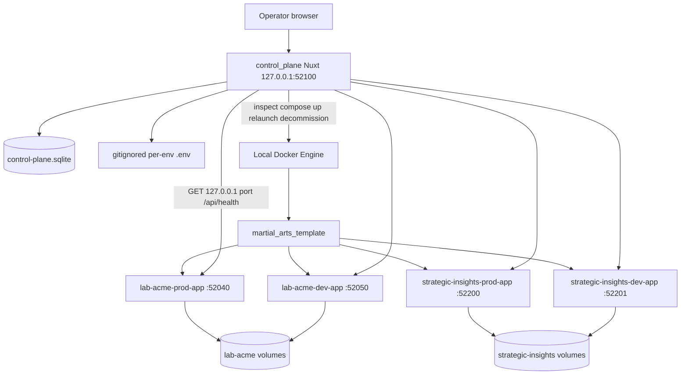

# Clean starting point — current state

Written 2026-09-10 from the repository, Git history, and vault notes on branch `working` at `18a1c0f` (pre-this-handoff tip). This remains the **architecture / “what exists”** baseline.

**Map update (same day, later):** IMM-01–04 are resolved. Official post-S4 path is Map B. Official S5 is **Successful** ([[wip/S5_closeout]]). See [[wip/Post_S4_Foundation_Decision_Closeout]] and [[SaaS-Milestones]]. Sections below that still say the map was not rewritten, that both S5s are live law, or that S5 is not Successful are **historical to this audit**.

It did **not** implement a new milestone. Related: [[wip/Clean_Starting_Point_Decision_Backlog]], [[wip/Clean_Starting_Point_Return]].

Older post-S4 handoff [[wip/Where_We_Are_Now_Post_S4_2026-09-09]] is **Superseded** for current UI/ops claims. Keep it as historical evidence of the pre-productization laptop state.

## How to read labels

| Label | Meaning |
|---|---|
| **Confirmed Implemented** | Code exists and matches the claim |
| **Confirmed Tested** | Automated tests cover the claim |
| **Implemented but Not Fully Verified** | Code exists; live Docker and/or browser click-through not re-checked in this session |
| **Documented Only** | Vault/plan text only |
| **Historical** | True when written; do not treat as current architecture |
| **Superseded** | Later code or ADR replaced it |
| **Partially Implemented** | Some of the intended behavior exists |
| **Not Implemented** | Absent in code |
| **Decision Required** | Still needs an owner/product/architecture answer |
| **Repository Fact** | Observable from Git/tree, not a product decision |
| **Lab-only Assumption** | Acceptable only on this laptop / loopback lab |

---

## 1. Executive Summary

This repository is a **sales-led martial-arts SaaS lab on one Windows laptop**. An operator can open http://127.0.0.1:52100, create a customer from four fields, and get an isolated PROD+DEV CRM pair that the same app can health-check, relaunch, extend with extra non-PROD environments, and decommission (process only; volumes stay).

The CRM product is `martial_arts_template/` (package `martial-arts-acquisition`). Branding is env-driven. The control plane is a separate Nuxt 4 operator app with a multi-page shell (Dashboard, Customers, Environments, Hosting Nodes, Settings) and record workspaces.

**Maturity:** S0–S4 are genuinely complete as laptop proofs. A **tentative** operator-UI slice after S4 shipped and is usable. That slice is **not** Successful S5 under either milestone map. The system is a **prototype / lab** — not a public product, not remote-hosted, not backed up as a fleet, and not operator-authenticated.

**Still prototype / lab-only:** loopback bind, no operator login, published host ports, `admin`/`setup` unwrap, laptop Docker only, Strategic Insights treated as disposable test data until a VPS cutover, no DNS/TLS, no remote nodes.

**Main components:** Control Plane registry + observe/provision/relaunch/decommission; Customer / Environment / Hosting Node model; Martial Arts template image; per-environment SQLite + assets volumes; gitignored per-env `.env` files.

**Biggest remaining gaps:** formal milestone map after S4 (dual S5 definitions); hostname/TLS; fleet backup/upgrade; operator auth before any non-localhost exposure; second industry template; paying-customer operations.

### If we stopped today, what do we actually have?

A laptop operator console that can register, provision, observe, relaunch, add extra non-PROD, and gated-decommission Martial Arts CRM environments in local Docker, plus a genericized Martial Arts CRM image derived from the external Renzo implementation. Two documented fleet customers: seeded **lab-acme** and provisioned **Strategic Insights Consulting, LLC**. No public product. No second industry. No remote hosting.

---

## 2. Current Repository Map

**Repository Fact.** This checkout lives at `C:\Users\Scoy9\Desktop\Projects\crm_marketing_saas`. Many durable notes still cite `C:\Users\Scoy9\Projects\crm_marketing_saas`. Do not move the repo to “fix” the docs.

```text
crm_marketing_saas/
├── .gitignore
├── control_plane/              # Operator app (S3+)
├── martial_arts_template/      # Martial Arts CRM product / image
└── crm_saas_vault/             # Obsidian vault (SaaS map + Renzo evidence)
```

No root `package.json`, no pnpm workspace, no root `AGENTS.md`, no ThePond, no nested `renzo_crm`.

| Path | Responsibility |
|---|---|
| `control_plane/` | Platform operator UI, SQLite registry, observe, relaunch, provision, extra non-PROD, gated decommission. Owns **which** customers/envs exist. Does not own CRM leads. |
| `martial_arts_template/` | CRM product: leads, households, trials, staff auth, `/api/health`, seed, Docker image, lab-acme compose, provisioned compose. |
| `crm_saas_vault/` | Durable SaaS notes at root; `wip/` is Scott↔Cursor communication; `wip/archive/` is evidence. Renzo notes at vault root are **historical**, not deploy law for this fleet. |

**Git (Repository Fact, 2026-09-10):**

| Item | Value |
|---|---|
| Branch | `working` (tracks `origin/working`) |
| Tip before this handoff | `18a1c0f` |
| `main` | `fe520d5` — first commit only; **does not contain** `control_plane/` or current SaaS notes |
| Remote | `origin` = https://github.com/Koifish95/crm_marketing_saas.git |

Do not audit or implement from `main`. Real Renzo is **not** in this repo (`C:\Users\Scoy9\Projects\renzo_crm`, Koi-Pi, `webhosting_renzo_*`).

Also present, **not** the control-plane fleet: template-triple `pnpm env:up` on ports 5000/5010/5020 with volumes `martial-arts-*-sqlite`. Do not register those rows.

---

## 3. Current Architecture

### Durable domain (S1 — still in force)

```text
Customer
  └── Environments
        exactly one PROD
        default one DEV
        extra non-PROD allowed as capability
        └── placed on a Hosting Node

Control Plane (separate app)
  └── registry of customers, nodes, environments
  └── observe / relaunch / provision / extra env / decommission
```

A container is **how** an environment runs today. Docker is not a permanent model requirement ([[Customer-Environment]]).

### Current local implementation (laptop Docker)



### Frontend / operator information architecture (post-S4 productization)

```text
Layout sidebar
├── Dashboard            /
├── Customers            /customers
│     ├── New customer   /customers/new
│     └── Workspace      /customers/:id  (overview | environments | configuration)
├── Environments         /environments
│     └── Workspace      /environments/:id  (overview | runtime | configuration)
├── Hosting Nodes        /nodes
│     └── Workspace      /nodes/:id
└── Settings             /settings  (placeholder)
```

**Confirmed Implemented.** The screenshot-era single long page with a form and cards is **Superseded**.

### Future infrastructure that does not exist yet

**Not Implemented:** VPS hosting node, remote Docker/SSH/agent, DNS, TLS, reverse proxy, image registry, fleet backup orchestration, operator authentication, public hostnames, Beauty template, billing.

---

## 4. Current Control Plane

**Confirmed Implemented** unless noted.

| Item | Fact |
|---|---|
| Stack | Nuxt 4, Vue 3, Nitro, Drizzle, libsql SQLite, Zod, Vitest, pnpm 10, Node >=22 |
| Bind | `127.0.0.1:52100` (`control_plane/shared/utils/listen.ts`). `strictPort: true` |
| Start | `cd control_plane && pnpm dev` — no Compose for the control plane itself |
| DB | `control_plane/data/control-plane.sqlite` (gitignored). Migrates + seeds on Nitro boot |
| Auth | **None.** No middleware, session, or API key |
| Data load | All operator pages use `useFleetStatus()` → `GET /api/status` (cache key `fleet-status`) |

### Navigation

Dashboard, Customers, Environments, Hosting Nodes, Settings (`control_plane/shared/utils/nav.ts`).

### Pages

| Route | What it does |
|---|---|
| `/` | Operational dashboard: customer/env/PROD/DEV/healthy/unhealthy/stopped/missing/node counts + Needs Attention table. **No provision form.** |
| `/customers` | Index + client search; New customer link |
| `/customers/new` | S4 form: display name, slug, timezone, admin email → `POST /api/customers` then `POST /api/customers/:id/provision` → redirect to workspace |
| `/customers/:id` | Workspace: Overview, Environments (table + add extra non-PROD), Configuration (read-only + gated decommission customer) |
| `/environments` | Index + search + type filter (PROD/DEV/STAGE/UAT/TRAINING) |
| `/environments/:id` | Workspace: Overview, Runtime, Configuration; header Refresh / Open (`accessUrl`) / Relaunch; gated decommission |
| `/nodes` | Index + search |
| `/nodes/:id` | Node identity + placed environments. No node CRUD |
| `/settings` | Placeholder: “Nothing to manage here yet.” |

### Shared UI

`AppPageHeader`, `AppStatusBadge`, `AppRefreshButton`, `AppSearchField`, `AppDataTable`, `AppAsyncPanel` (loading / error / empty), `AppWorkspaceTabs`, `AppAccessLink`. Skip link, `aria-busy`, `aria-live`, stacked nav below 48rem.

### APIs

| Method | Path | Role |
|---|---|---|
| GET | `/api/status` | Observe Docker + health for registered envs |
| GET | `/api/environments` | Registry list **without** live health; unused by UI |
| POST | `/api/customers` | Create or resume customer + default PROD/DEV + env files |
| POST | `/api/customers/:id/provision` | Build/up + health wait |
| POST | `/api/customers/:id/environments` | Extra non-PROD + auto-provision |
| POST | `/api/customers/:id/decommission` | Decommission all customer envs |
| POST | `/api/environments/:id/relaunch` | Safe compose recreate |
| POST | `/api/environments/:id/decommission` | Stop/remove process; keep volumes |

No GET-by-id APIs. No customer/environment edit APIs. **No UI re-provision button** on the customer workspace (retry is API-only after a partial `/customers/new` failure).

### Health / status

Combined status (`control_plane/server/services/health.ts`):

- `healthy` = running **and** `/api/health` `{ ok: true, database: "reachable" }`
- `stopped` = container exists, not running
- `missing` = container not found (**Confirmed Implemented**; distinct from stopped)
- `unhealthy` = running but health fails
- `unknown` = inspect failed

Needs Attention = `unhealthy` | `unknown` | `missing` (not `stopped`, not decommissioned). Customer/node overall = worst env (`unhealthy` > `unknown` > `missing` > `stopped` > `healthy`).

Refresh re-runs observe. Health is **on-demand**, not polled.

### Search / filter / pagination

Client-side only. No server pagination or sort. **Partially Implemented** vs the inventory’s full scalability list.

### Diagnostics

Per-env `healthError`, action `statusMessage`, last checked timestamp. **Not Implemented:** container logs viewer, operator audit trail, activity history, alerts, capacity.

### Responsive / a11y

Hardening sprint added skip link, live regions, table overflow wrap, breadcrumbs. **Implemented but Not Fully Verified** in a real browser this session.

### Tests

15 files under `control_plane/tests/` (`s3/`, `s4/`, `s5/`). Audit claimed 34 tests at `3f5e399`. No Vue component mount tests. No live-Docker integration tests beyond command-shape assertions.

---

## 5. Current Provisioning Capability

**Confirmed Implemented** + **Confirmed Tested** (unit/API-shape). Live Docker proof is **Historical** from S4 closeout (`27127af`); **not re-verified** this session.

### Operator inputs

`displayName`, `slug`, `timezone` (default `America/Denver`), `adminEmail`.

### Customer creation

- Industry template hardcoded `martial-arts`
- Hosting node hardcoded `laptop`
- Stable UUIDs for customer and environments
- Slug: lowercase `^[a-z][a-z0-9-]{1,46}[a-z0-9]$`, no `--`
- Reserved: `lab-acme`, `renzo`, `martial-arts`, `webhosting` (and substring `renzo` / `webhosting`)

### Default pair

Exactly one PROD + one DEV. Names `{slug}-prod` / `{slug}-dev`. Containers `{slug}-prod-app` / `{slug}-dev-app`. Compose file `docker-compose.provisioned.yml`. Image `martial-arts-acquisition:s4`.

### Ports

Allocated from **52200–52999**. Health URL `http://127.0.0.1:{port}/api/health`. Access URL `http://localhost:{port}`.

### Volumes / assets

Named `{env-slug}-sqlite` and `{env-slug}-assets`. Mounted at `/app/data/sqlite` → `crm.sqlite` and `/app/data/uploads`. Isolation marker `{env-slug}-isolation`.

### Secrets / admin bootstrap

Gitignored `control_plane/data/provisioned/{environmentId}.env`. Random `NUXT_SESSION_PASSWORD`. Unwrap `admin` / `setup` + `NUXT_AUTH_MUST_CHANGE_PASSWORD=true`. Registry stores **paths**, not live passwords.

### Docker / Compose

`docker image inspect` → if missing, `docker build -t martial-arts-acquisition:s4 .` in `martial_arts_template` (or `TEMPLATE_ROOT`). Then `docker compose --env-file … -f docker-compose.provisioned.yml -p {project} up -d --no-deps app`.

### Health wait

Up to 60 × 3s (~180s). Success requires `ok` + `database: reachable`. Lifecycle: `provisioning` → `ready` or `failed`.

### Retry / resume

Same slug returns existing customer (`resumed: true`). Re-provision skips decommissioned; skips already-healthy `ready`; otherwise `up` again. Partial success is allowed; HTTP 500 only if **all** envs fail.

### Failure / cleanup

**No cleanup.** Failed rows stay `failed`. Env files stay. Volumes are never auto-deleted (matches accepted default). **Decision Required** for continue-vs-rebuild semantics.

### Extra non-PROD (after original S4)

Types `DEV` | `STAGE` | `UAT` | `TRAINING`. Slug `{customer}-{normalized-label}`. Second PROD refused in API. Auto-provisioned. This is **ahead of historical S6**.

### Current limitations

Synchronous; sequential health probes; no progress UI; no transaction around Docker; no UI retry after create-succeeds/provision-fails; always `laptop`; always Martial Arts.

### Historical difference vs S4 closeout

S4 closeout: form on the single dashboard; no extras UI; no decommission. Current: form at `/customers/new`; extras + decommission shipped (`520cbe8`, `cfe47a9`).

---

## 6. Customer / Environment / Hosting Node Model

### Durable model (ADRs / [[Customer-Environment]])

- Stable Customer ID and Environment ID (UUIDs). Slug/display name are attributes.
- Exactly one PROD per customer.
- Default entitlement PROD+DEV. Extra non-PROD is a capability, not billing.
- Environment placed on a Hosting Node; node is not owned by the environment.
- Customer owns branding defaults; environment owns runtime/secrets.
- Inheritance without silent override clobber (**Documented Only** — no override engine).
- Environment-specific credentials by default.
- No sibling/cross-customer data access. PROD→DEV copy-down only as an explicit later action.
- Docker is an implementation, not the model.

### Current implementation

| Rule | Code |
|---|---|
| Stable IDs | **Confirmed Implemented** — `crypto.randomUUID()` |
| Slug unique | **Confirmed Implemented** — unique index |
| One PROD | **Confirmed Implemented** in API (`assertOneProdPerCustomer`). **Not** a SQL unique constraint |
| Default PROD+DEV | **Confirmed Implemented** |
| Extra non-PROD | **Confirmed Implemented** (DEV/STAGE/UAT/TRAINING). Custom display names allowed; default-pair display names are still `PROD`/`DEV` |
| Node placement | **Partially Implemented** — always seeded `laptop` / `local-docker`. No node CRUD |
| Version tracking | **Partially Implemented** — `expectedImage` text (`s2` lab, `s4` provisioned). No upgrade action |
| Env-specific secrets | **Confirmed Implemented** — per-env `.env` |
| Independent DB/assets | **Confirmed Implemented** — named volumes |
| Inheritance/overrides | **Not Implemented** |
| Lifecycle | `provisioning` \| `ready` \| `failed` \| `decommissioned` — **Confirmed Implemented**. Customer-Environment note still says decommission is later — **Superseded** by code |

### Gaps

Conceptually decided, not fully enforced: SQL one-PROD invariant; node choice; inheritance engine; entitlement vs capability; slug immutability after DNS (policy only).

---

## 7. Current Martial Arts Template

Inspected on `working`, not `main`. `main`’s copy is still Renzo-named; that is **not** the current product tree.

### Generic now

Package `martial-arts-acquisition`; `shared/utils/brand.ts` defaults *Martial Arts Acquisition* / *Martial Arts* / *Academy*; env overrides `NUXT_PUBLIC_APP_NAME` / `BRAND_NAME` / `BRAND_LOCATION`; public hostnames empty; `/api/health` generic; provisioned compose parameterized; logging prefix `[martial-arts]`; backup zip names `martial-arts-…`.

### Martial Arts-specific (intentional)

Seed programs Adult/Kids BJJ (active), Striking/Wrestling (inactive); `/trial` + household + intro domain; “New to jiu-jitsu”; public “Book a free class” copy. Household is **template, not platform core** (ADR).

### Lab-specific

`docker-compose.lab-acme-*.yml` on 52040/52050; Acme branding; `crm.sqlite` in lab/provisioned; lab helper scripts refuse `down -v`. `.env.lab-acme-*.example` referenced but **missing** from the tree.

### Renzo leftovers

**Intentional:** safety comments, reserved slugs, `Refresh-FromSibling.ps1`, docs warning not to touch `renzo_crm` / Pi volumes, tests asserting Renzo hostnames are not configured.

**Accidental:** `app/pages/settings/environment.vue` client fallback filename `renzo-${appEnv}-backup.zip`; `drizzle/intro-seed.ts` Kaysville timetable (test fixtures, not product seed); `martial_arts_template/AGENTS.md` still a Renzo gym briefing.

### Seed / trial / auth / storage / naming

| Topic | Current |
|---|---|
| Catalog seed | Idempotent programs, sources, lost reasons, access catalog. **No** intro rules or prices in product seed |
| `/trial` | Hidden until ADMIN publishes intro availability |
| Bootstrap | Password required to seed. Provisioned path: `admin`/`setup` + must-change. Lab Acme: `setup` **without** forced change (**Lab-only Assumption**) |
| Health | `{ ok, app, timezone, database, appEnv }` |
| SQLite | Local/template triple: `app.sqlite`. Lab/provisioned: `crm.sqlite`. Backup scripts assume `app.sqlite` — debt |
| Images | Template/lab `:s2`. Provisioned `:s4` |

Template tests: 67 files. Control-plane tests: 15 files.

---

## 8. Current UI / UX State

**Confirmed Implemented.** Previous “single long page with a form and cards” assessment is **stale / superseded**.

### Information architecture

Customer-primary hierarchy with a fleet Environments index and a Hosting Nodes index. Provisioning lives at **Customers → New customer**, not the dashboard.

### Lists / workspaces

Tables with client search. Environment type filter. Workspaces use tabs. Configuration is read-only except gated decommission and extra-env create.

### Scalability

Fine for a handful of laptop customers. No pagination, no server filter, sequential health probes. **Partially Implemented.**

### Operational dashboard

Counts + Needs Attention. No provision form. No full record dump.

### Remaining UX debt

- No re-provision button after partial failure
- Settings empty
- No activity history, logs, or backup status
- Configuration cannot be edited
- Real-browser click-through never officially completed (HTML/API only)
- Audit observed **Still Beauty, LLC** on the laptop fleet at QA time (6 envs) with no template decision — **Implemented but Not Fully Verified** this session; treat as undocumented lab row, not a Beauty pilot

---

## 9. Current Operations Model

| Capability | State |
|---|---|
| Runtime state | **Confirmed Implemented** — inspect running/stopped/missing/unknown |
| Health | **Confirmed Implemented** — on-demand combined status |
| Relaunch | **Confirmed Implemented** — `--force-recreate --no-deps app`; never `-v` |
| Provision | **Confirmed Implemented** |
| Last checked | **Confirmed Implemented** — `checkedAt` |
| Lifecycle status | **Confirmed Implemented** — provisioning/ready/failed/decommissioned |
| Logs | **Not Implemented** in control plane |
| Diagnostics | **Partially Implemented** — `healthError` + action errors |
| Activity history | **Not Implemented** |
| Background polling | **Not Implemented** (on-demand is an S3 ADR) |
| Alerting | **Not Implemented** (partial-failure alert is planned only) |
| Capacity | **Not Implemented** |
| Decommission | **Confirmed Implemented** — process removed; volumes + rows + env files kept |

---

## 10. Current Security Model

| Topic | State |
|---|---|
| Operator authentication | **Not Implemented.** Accepted ADR: required **before** the control plane leaves localhost |
| Control-plane exposure | Loopback only — **Lab-only Assumption** |
| Docker-control boundary | CRM containers never receive a Docker socket. Compose args refuse `down`, `-v`, `prune`. Registered container names only |
| Customer CRM auth | Session login in the template. New envs unwrap `admin`/`setup` + must-change |
| Bootstrap credentials | Written to gitignored env files on disk. **Decision Required** for how they are delivered later |
| Secrets storage | Paths in registry; values on disk. Not a secret manager |
| CSRF / session (CP) | None |
| Public exposure | **Not Implemented** — must not publish until unwrap password changed (ADR) |
| Audit trail | **Not Implemented** on the control plane |

Anyone on the laptop who can reach 52100 and read `data/provisioned/` can operate the fleet. Acceptable only while local/lab-only.

---

## 11. Current Data / Storage Model

### Control-plane data

SQLite at `control_plane/data/control-plane.sqlite`. Tables: `customers`, `hosting_nodes`, `environments` (`control_plane/server/database/schema.ts`). Migrations `0000`–`0002`. Persists across CP restarts. Gitignored. Seed inserts `lab-acme` + `laptop` + two lab envs (idempotent).

### Customer CRM data

Per-environment SQLite in a named volume (`crm.sqlite` for lab/provisioned). WAL/SHM exist as SQLite runtime files inside the volume. Init: container `runtime-init` migrate + seed.

### Assets

Per-environment volume at `/app/data/uploads`.

### Secrets

Generated in `provision-env.ts`. Stored as gitignored files. Registry stores `envFileLocal` paths.

### What is not shared

Customers do not share DBs or assets. PROD and DEV do not share volumes. External Renzo volumes must never be attached. Template-triple `martial-arts-*` volumes are a separate local stack.

---

## 12. Current Runtime / Docker Model

| Item | Fact |
|---|---|
| Images | `martial-arts-acquisition:s2` (lab-acme + template triple), `:s4` (provisioned) |
| Local build | On first provision if `:s4` missing |
| Container names | `{env-slug}-app` for provisioned; `lab-acme-*-app` for lab |
| Compose | Lab-specific files vs generic `docker-compose.provisioned.yml` |
| Volumes | `{env-slug}-sqlite` / `-assets` |
| Networks | Per compose project |
| Ports | Acme 52040/52050; provisioned 52200–52999; CP 52100 |
| Isolation | Separate projects, volumes, env files, isolation markers |
| Relaunch | Recreate `app` only; remount same volumes |
| Provision | `up -d --no-deps app` (no force-recreate) |
| Laptop-specific | Docker Desktop, published host ports, OneDrive-aware template build scripts, Windows paths |
| Blocks another machine | No image registry; env files and volumes do not follow git; CP DB is local |

Do not design remote hosting here.

---

## 13. What Has Actually Been Proven

Live Docker was **not re-inspected** in this reconciliation session. Evidence below uses closeouts + tests + code.

| Capability | Code | Automated test | Integration/API test | Live Docker | Browser | Notes |
|---|---|---|---|---|---|---|
| Isolated PROD/DEV | Yes | Yes | Partial | **Historical** S2/S4 | Not verified | Acme + SI in closeouts |
| Multiple customers coexist | Yes | Registry tests | Status API in S4 closeout | **Historical** | Not verified | Acme + SI; audit also saw Still Beauty |
| Persistent volumes / no `-v` | Yes | Relaunch arg tests | S4 relaunch | **Historical** | Not verified | |
| Health | Yes | Yes | Closeout status | **Historical** | Not verified | |
| Relaunch | Yes | Yes | S4 + audit API | **Historical** | Not verified | |
| Provision | Yes | Yes | S4 closeout | **Historical** | Not verified | |
| Same-slug resume | Yes | Yes | S4 + audit `resumed=true` | — | — | SI id `5b3b4674-84df-440d-855b-113689bab69d` |
| Admin bootstrap / force-change | Yes | Template bootstrap tests | S4 login API | **Historical** | Not verified as click-through | Lab Acme does **not** force change |
| Registry persistence | Yes | Seed idempotency | — | — | — | |
| Current frontend workflows | Yes | S5 nav/fleet tests | HTML/API audit | — | **Not verified** | |
| Search / workspaces | Yes | S5 tests | HTML audit | — | **Not verified** | |
| Extra non-PROD | Yes | Registry tests | — | Not in S4 closeout | Not verified | Ahead of historical S6 |
| One-PROD API | Yes | Yes | — | — | — | |
| Gated decommission | Yes | Compose-arg + skip tests | — | Not independently proven here | Not verified | Volumes preserved by construction |
| Public hostname | No | — | — | — | — | **Not Implemented** |
| Fleet backup | No | Template in-app zip only | — | — | — | CP does not orchestrate |
| Sister / Beauty template | No | — | — | — | — | **Not Implemented** |

---

## 14. Milestone-by-Milestone Reconciliation

Do not reorganize the map here. Historical approved path and tentative path both exist.

### S0 — Workspace split

| | |
|---|---|
| Official Successful | Own repo, not `renzo-crm`; Renzo PRODUCTION untouched; two-track agreement |
| Recorded status | Successful |
| Implemented | Independent Git repo + origin; vault Working-Agreement |
| Tested | N/A (process) |
| Genuinely complete? | **Yes** |
| Stale wording | Path `Projects\` vs actual `Desktop\Projects\` |
| Ahead / missing | `main` is still the first commit; product lives on `working` |

### S1 — Environment unit

| | |
|---|---|
| Official Successful | Durable Customer-Environment note: one PROD, default PROD+DEV, inheritance rule, env secrets, minimal health |
| Recorded status | Successful (2026-09-08) |
| Implemented | Note exists; later code implements most of the unit |
| Genuinely complete? | **Yes** as a **decision** milestone |
| Stale wording | Lifecycle paragraph still says decommission is later |

### S2 — Second martial-arts environment by hand

| | |
|---|---|
| Official Successful | Second MA CRM in Docker; isolated `lab-acme-*` volumes; own admin login; green health; not Renzo PRODUCTION; repeatable checklist |
| Recorded status | Successful (2026-09-09) |
| Implemented | Lab compose + isolation + image `martial-arts-acquisition:s2` |
| Tested | S2 isolation/brand tests; historical Docker proof |
| Genuinely complete? | **Yes** as a lab proof |
| Stale wording | Successful text says admin login **not** `setup`. Later ADR made `setup` the unwrap key for **new** S4 envs. Historical S2 text was not rewritten — **Historical**, do not silently “fix” |

### S3 — Control plane v1

| | |
|---|---|
| Official Successful | See environments; up/down = running **and** health; relaunch without destroying volumes; human headlines |
| Recorded status | Successful (2026-09-09) |
| Implemented | `control_plane/` observe + relaunch. App: http://127.0.0.1:52100 |
| Tested | `tests/s3/*` |
| Genuinely complete? | **Yes** for v1 observe/relaunch |
| Stale wording | Milestone section and S3 closeout say “S4 is not started.” S3 runbook still excludes SI provision |
| Ahead | Frontend is now multi-page; extras/decommission exist (not S3 scope) |

### S4 — Sales-led provision

| | |
|---|---|
| Official Successful | Operator produces a new MA env the CP shows healthy; second time uses the same procedure |
| Recorded status | Successful (2026-09-09) |
| Implemented | Two POSTs + provisioned compose + SI laptop proof |
| Tested | `tests/s4/*`; live proof in closeout |
| Genuinely complete? | **Yes** for default-pair provision on this laptop |
| Stale wording | Runbook still says “No extra-environment button”; closeout “S5 was not started” (true for historical S5; tentative UI later shipped) |
| Ahead | extras, decommission, missing status, operator UI |

### Historical S5 — Reachable customer access

| | |
|---|---|
| Official Successful | Staff hit a **hostname**, real password, run CRM; no touch of `app.renzogracieutah.com` |
| Recorded status | **Not started** |
| Implemented | `accessUrl` stores `http://localhost:{port}` only. That is **not** DNS |
| Genuinely complete? | **No** — status is accurate for this definition |
| Scope that should move? | Scott/ChatGPT decide after this baseline |

### Historical S6 — Fleet operations

| | |
|---|---|
| Official Successful | Backup/restore without killing others; template update to non-Renzo stays healthy; off-host copy minimum viable |
| Recorded status | **Not started** |
| Implemented | Extra non-PROD UI and decommission exist (old S6 “decide along the way” items) |
| Missing despite status | Backup, restore, upgrade, rollback, registry — **Not Implemented** |
| Ahead of map | extras UI, decommission |

### Historical S7 — Owner dogfood path

| | |
|---|---|
| Official Successful | Owner has a normal CRM **and** CP access; prospect funnel; not a special fork |
| Recorded status | **Not started** |
| Implemented | SI is a normal Martial Arts customer row (lab). Owner dogfood as a sales CRM is **not** proven |
| Decision | SI is disposable test data until VPS |

### Historical S8 — First external martial-arts customer live

| | |
|---|---|
| Official Successful | Real non-Renzo academy, reachable, backed up, on CP, relaunchable; no Renzo DB copy. This **is** “launched” on the approved map |
| Recorded status | **Not started** |
| Accurate? | **Yes** |
| Later ADR | Launch = first customer on a VPS (post-S4 ten decisions) — **working overlay**, not a rewritten S8 Successful line |

### Tentative S5 — Control Plane Productization / Operations Foundation

| | |
|---|---|
| Recorded status | First slice authorized. **Not Successful** |
| Implemented | Multi-page operator app, workspaces, search/filter, extras, missing, one-PROD API, gated decommission |
| Accurate? | Status is honest: work shipped, milestone not closed |
| Conflict | Same ID as historical S5 |

### Tentative S6–S11

**Documented Only.** Not started. Provisional. Do not treat as approved Successful path.

---

## 15. Features Implemented Ahead of Their Milestones

Repository evidence:

| Feature | Historical map placement | Evidence |
|---|---|---|
| Multi-page operator UI / workspaces | After S4; not in historical S5 (hostname) | `5c32a8f`, `a3b9efe`, `f61bcdf` |
| Extra non-PROD create | S6 “operator-add extra” / S4 “pair only” | `520cbe8`, `POST /api/customers/:id/environments` |
| Gated decommission | Later / S4 exclusions | `cfe47a9` |
| Missing vs stopped | Not in S0–S4 Successful text | `f1fb22f` |
| One-PROD API enforcement | S1 conceptual; not S4 code | `f1fb22f`, `assertOneProdPerCustomer` |
| `accessUrl` localhost links | Convenience; not historical S5 | `b33e049`, `438323a` |

---

## 16. Milestone Work That Is Still Missing

### Critical (blocks public / paying / remote)

- Hostname + TLS + real (changed) password before publish
- Operator auth before CP leaves localhost
- Fleet backup/restore off this laptop
- Image story for a second machine / VPS
- Formal next-milestone choice (dual S5)

### Should-do (before a serious pilot)

- Provision retry/progress UX
- Customer field edit policy implemented or locked
- Activity/audit of operator actions
- Honest runbook updates (or rely on this file)
- Re-verify live Docker + browser click-through
- Resolve undocumented Still Beauty row if it still exists
- Template `AGENTS.md` / SQLite name split / missing lab env examples

### Nice-to-have

- Vue component tests
- Server pagination
- Parallel health probes
- Settings content
- Beauty / generic CRM extraction
- Billing

Do **not** treat missing optional browser QA as a false S0–S4 blocker. It does mean frontend claims stay **Implemented but Not Fully Verified**.

---

## 17. Current Technical Debt

| Area | Item | Local dev? | Pilot? | Public? | Paid launch? |
|---|---|---|---|---|---|
| Architecture | Dual S5 maps; `main` vs `working` split | No | Confuses sequencing | — | — |
| Architecture | Always `laptop`; published host ports vs S1 `expose` model | No | Yes for remote | Yes | Yes |
| Architecture | One-PROD not in SQL | No | Low | Low | Should fix |
| CP frontend | No retry button; empty Settings; no component tests | No | UX friction | — | — |
| Provisioning | No cleanup; retry semantics unset; sync only | No | Partial-failure risk | Yes | Yes |
| Runtime/Docker | `s2` vs `s4`; no registry | Second PC blocked | Yes | Yes | Yes |
| Database/storage | `app.sqlite` vs `crm.sqlite`; CP DB/env files machine-local | Second PC | Yes | Yes | Yes |
| Security | No operator auth; unwrap `setup`; HTTP cookies; secrets on disk | No | Yes if shared LAN | **Blocks** | **Blocks** |
| Operations | No logs, poll, alert, backup status, audit | No | Yes | Yes | Yes |
| Testing | No official browser QA; Docker not re-verified here | No | Confidence | — | — |
| Documentation | Stale runbooks/closeouts; template AGENTS still Renzo; path drift | Confusion | Confusion | — | — |
| Template abstraction | MA domain baked in; leftover Renzo filename | No | Sister/Beauty blocked | — | Second industry |
| Hosting | Laptop only | No | Real dogfood limited | **Blocks** | **Blocks** (launch = VPS) |

---

## 18. Current Blockers

| Transition | Blocker(s) |
|---|---|
| Continue local development | None technical. Sequencing **Decision Required** so work does not accidentally start historical S5 DNS |
| Real Strategic Insights dogfood | SI is disposable until VPS; MA template may not fit; no public URL; data not treated as durable |
| Second pilot (sister) | Beauty template **Not Implemented**; sister not provisioned; do not build Beauty in the current leftover slice (ADR) |
| Remote control-plane access | Operator auth, bind beyond loopback, TLS, CSRF/session, audit |
| Public customer access | Hostname, TLS, unwrap password changed, stop publishing raw host ports (recommended), legal/privacy unset |
| External pilot | Public access + backups + support channel + not-disposable data |
| Paying customer | VPS hosting (accepted launch definition), backups, upgrades, operational promises, how you get paid |
| Multiple hosting nodes | Node comms, placement UI, registry, secrets-for-N-machines |
| Second industry | Template boundary / shared CRM extraction **Decision Required**; Beauty not designed |

---

## 19. Decisions Already Made

Deduplicated current register. Do not silently rewrite ADR history.

| Decision | Source | Status | Implementation impact |
|---|---|---|---|
| This tree is its own Git repo | 2026-09-08 ADR | Durable / executed | `origin` Koifish95/crm_marketing_saas |
| Renzo is external evidence, not a customer | 2026-09-09 ADR | Durable | Reserved slugs; never attach Renzo volumes |
| Two tracks; no `tenant_id` rewrite | 2026-09-08 + Working-Agreement | Durable | Separate CP + template |
| S1 environment unit | 2026-09-08 ADR | Durable | Model above |
| S0–S8 Successful language / launched = S8 on **approved** map | 2026-09-08 ADR | Working — overlayed by VPS launch ADR and tentative map | Do not pretend the map was rewritten |
| CP v1 = separate app, observe + relaunch | 2026-09-08 ADR | Working — create/provision **Superseded** by S4 | Observe/relaunch still law |
| S3 laptop-only, local Docker, on-demand health | 2026-09-09 ADR | Durable / lab | 52100 loopback |
| S2 lab-acme coexistence | 2026-09-09 ADR | Durable (lab proof) | Seeded rows |
| MA template product defaults | 2026-09-09 ADR | Durable | BJJ seed; `/trial` hidden; household = template; USD through S8 |
| Generated labs use admin/setup | 2026-09-09 ADR | Durable | Seed throws if password missing |
| S4 form, local image, per-env `.env`, pair-only **at S4 time** | 2026-09-09 ADR | Durable; extras timing **Superseded** by ten decisions | Still four fields |
| S4 Successful / SI laptop proof | 2026-09-09 ADR | Durable | Procedure exists |
| SI = test data until VPS; then must persist | 2026-09-09 ten decisions | Durable | Do not treat laptop SI as production |
| Hosting stays laptop until launch, then VPS; CP stays local until that move | Ten decisions | Durable | Not Pi-first |
| Operator login before CP leaves localhost; Scott-only Platform Administrator until stated otherwise | Ten decisions | Durable | Auth not built yet |
| One PROD API-enforced; extra non-PROD now; decommission before VPS; never auto-delete volumes | Ten decisions | Durable / implemented | extras + decommission shipped |
| Missing ≠ Stopped | Ten decisions | Durable / implemented | |
| No slug edit until DNS; display/timezone/email read-only until leftover Q answered | Ten decisions | Durable | No edit APIs |
| Sister is second real pilot; do not build Beauty in this slice | Ten decisions | Durable | Sister not provisioned |
| Launch = first customer on the VPS | Ten decisions | Working overlay on S8 | |
| Product domain / hostname unset; `labforleads.com` is not an ADR | Ten decisions | **Decision Required** to implement DNS | Do not implement DNS |
| Relaunch never `down -v` | All milestones | Durable | Compose guards |
| Sales-led, not self-service | Milestones | Durable | Provision is operator form |
| Do not publish hostname until unwrap password changed | S4 ADR | Durable | |

---

## 20. Decisions Still Required

Full operator list: [[wip/Clean_Starting_Point_Decision_Backlog]]. Condensed here.

### Immediate — before the next implementation milestone

1. **What is the next authorized milestone?** Historical S5 (DNS) vs more CP/fleet work vs pause. Blocks Cursor from starting the wrong work. Cursor can continue **docs/tests/template hygiene only** without the answer — **not** a new platform milestone.
2. **Failed provision retry: continue vs rebuild?** Blocks honest retry UX and cleanup. Cursor should not invent auto-delete.
3. **May operators edit display name / timezone / admin email?** Blocks Configuration-tab write APIs.
4. **Product domain / hostname shape?** Only if someone wants to start historical S5. Informal `labforleads.com` is not enough.

### Near-term — before pilot / public exposure

Backup location and retention; restore from CP; image registry / second machine; upgrade/rollback policy; operator-auth implementation details; bootstrap credential delivery; audit trail; hostname/TLS/DNS provider; stop publishing CRM host ports; what successful SI dogfood means; whether a generic CRM is required before SI is “real.”

### Later — safe to defer

Beauty extraction and shared CRM core; extra-env commercial pricing; billing processor; remote node protocol; capacity rules; legal/privacy pack; self-service.

---

## 21. Stale / Superseded Documentation

| Document | Recommendation |
|---|---|
| [[wip/Where_We_Are_Now_Post_S4_2026-09-09]] | **Superseded** by this file. Keep historical |
| [[wip/S5_Control_Plane_Productization_Status]] | Still useful for sprint SHAs; leftover “still to do” extras/decommission are **Superseded** |
| [[wip/Control_Plane_Post_Productization_Audit]] | Historical QA evidence; extras/decommission listed as deferred — **Superseded** |
| [[wip/S5_And_Beyond_Cursor_Prompt]] | Leftover sprints shipped; do not re-run as if open |
| [[SaaS-Milestones]] S3 “S4 is not started”; dual S5 tables | Stay historical until Scott/ChatGPT reorganize; do not rewrite Successful text here |
| [[S3-Control-Plane-Runbook]] SI/sister/decommission exclusions | Update or mark superseded by this file |
| [[S4-Provision-Runbook]] “No extra-environment button” | Tiny correction applied with this handoff |
| [[S2_closeout]] / [[S3_closeout]] / [[S4_closeout]] | **Stay historical** |
| [[Customer-Environment]] decommission “later” | Tiny correction applied |
| [[Control-Plane]] “no extras UI” | Tiny correction applied |
| [[SaaS-ToDo]] leftovers checkbox | Tiny correction applied |
| [[Working-Agreement]] path `Projects\` | Leave; recorded as path drift |
| `martial_arts_template/AGENTS.md` | Update later (Renzo briefing in a genericized tree) |
| `crm_saas_vault/wip/_index.md` | Point at this file as current (updated) |
| Vault Renzo notes (`Overview`, `Implementation-State`, …) | Stay historical evidence |
| `main` branch vault | Pre-S0 discovery snapshot — ignore for current architecture |

**This file supersedes** “where are we now” claims. Durable ADRs stay in [[SaaS-Decisions]]. The milestone map stays in [[SaaS-Milestones]] until formally reorganized.

---

## 22. Current Pilot State

### Strategic Insights

| Question | Answer |
|---|---|
| Provisioned? | **Yes** (S4 laptop proof). Customer id `5b3b4674-84df-440d-855b-113689bab69d`. PROD `165919e5-2a57-4f26-beb0-d806034a18ed` :52200. DEV `44a62387-142a-4f41-af53-801a9b2592a5` :52201 |
| Real or lab? | Lab / test data until VPS |
| Template? | Martial Arts (not a long-term fit — **Decision Required** later) |
| Disposable or durable? | Disposable on the laptop; must be persisted when provisioned on the VPS |
| Environment status? | Closeout: both healthy on 2026-09-09. **Not re-verified** 2026-09-10 |
| Actual dogfood use? | **Not proven** by the repo |

### Scott's sister's business

Not provisioned. Beauty template not built. ADR: she is the second real pilot; do not build Beauty in the leftover slice.

### External paying customer

None.

### Other fleet rows

- **lab-acme** — S2 proof, seeded, not a paying customer.
- **Still Beauty, LLC** — observed in the 2026-09-09 frontend audit (6 envs on the laptop). No Beauty-template decision. **Do not infer** a sister-business provision from that row.

---

## 23. Current Launch Readiness

Launch here means the accepted overlay: **first customer on a VPS**, sales-led, martial arts first. Historical S8 Successful also requires reachable + backed up.

| Category | Mark |
|---|---|
| Product (MA CRM) | **Partial** — feature-rich template; still lab-branded defaults; M8/M9 human acceptance is a Renzo-track leftover, not a SaaS gate |
| Control-plane UX | **Partial** — multi-page operator app exists; not Successful S5 |
| Provisioning | **Partial** — laptop pair + extras work; no async/progress/cleanup policy |
| Backups/recovery | **Not Ready** — template zip exists; no fleet orchestration; not off-host |
| Upgrades | **Not Ready** |
| Hosting | **Not Ready** — laptop only |
| Security | **Not Ready** for anything but loopback |
| DNS/TLS | **Not Ready** / **Decision Required** |
| Monitoring | **Not Ready** |
| Support | **Not Ready** |
| Legal/privacy | **Decision Required** / **Not Ready** |
| Billing/entitlements | **Not Required for initial launch** (invoice/contract enough to start) |
| Second template | **Not Required for initial launch** (sister/Beauty deferred) |
| Dogfood | **Partial** — SI provisioned as disposable lab |

---

## 24. Clean Starting Point

### What is now considered complete and closed

- S0 workspace split (repo + two-track agreement)
- S1 environment-unit **decision**
- S2 lab-acme hand-boot proof
- S3 observe + relaunch v1
- S4 sales-led default-pair provision (laptop)
- Post-S4 leftover slice that Scott authorized: missing status, one-PROD API, extra non-PROD, gated decommission, operator multi-page UI

Do not re-open those as if they never shipped.

### What should remain untouched

- External `renzo_crm`, Koi-Pi, `webhosting_renzo_*`, Renzo DNS/TLS
- Renzo vault notes as historical evidence
- Historical closeout Successful wording (including S2 “not setup”)
- Strategic Insights data (do not treat as production; do not “fix” it into a Beauty/generic CRM)
- `main` as a clean first-commit pointer unless Scott asks to merge

### What can safely continue being developed

Only after Scott reviews this baseline, and only work that does **not** start a new milestone:

- Documentation hygiene that does not rewrite the milestone map
- Tests that lock existing behavior
- Template briefing/path drift that does not change product scope

Cursor must **not** start DNS, TLS, Beauty, backups, operator auth, registry, or another customer provision unless Scott asks.

### What should NOT be worked on yet

DNS/GoDaddy/TLS/proxy; remote nodes; backup/restore orchestration; image registry; upgrade/rollback; operator auth; Beauty/generic CRM; billing; customer hard-delete; new provision architecture; treating SI as durable; touching Renzo; rewriting [[SaaS-Milestones]] into a final roadmap.

### What the next milestone should probably focus on

**Decision Required.** Factual recommendation only (not a rewrite):

The next *implementation* should **not** automatically be historical S5 (hostname/TLS). The laptop product’s next risk is **operations and sequencing**, not a public hostname. Scott and ChatGPT should choose among:

1. Close/rename tentative productization as a completed foundation slice and write a new map;
2. Fleet reliability (backup/restore/upgrade) before any public URL;
3. Stay paused on implementation until the dual-S5 map is replaced.

### Which decisions must be resolved before finalizing that milestone

See Immediate items in §20 and [[wip/Clean_Starting_Point_Decision_Backlog]]: next authorized milestone; retry semantics; editability; domain only if DNS is chosen.

### Which work Cursor can continue while Scott/ChatGPT answer

None of a new platform milestone. Optional: keep this reconciliation accurate if they ask for corrections. Do not begin the next milestone until Scott reviews this clean starting point.
