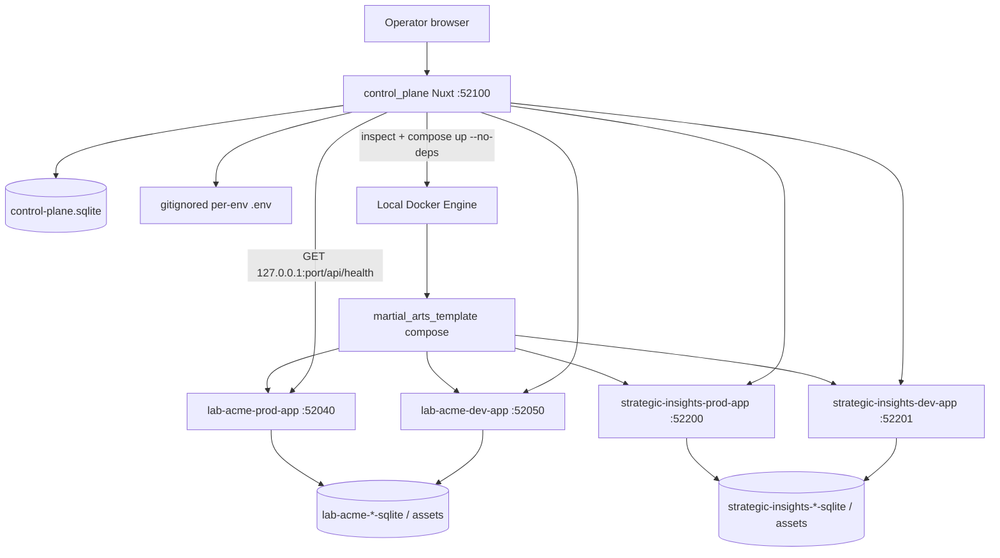

# Where we are now — post-S4 architecture and project-state handoff

Written 2026-09-09 from the repository, Git history, and current vault notes. This is a **reconciliation handoff** for Scott and ChatGPT before any milestone reorganization.

**This note does not implement S5.** It does not reorganize S5–S8. It does not decide DNS, hostnames, or TLS.

Related: [[Home]], [[Working-Agreement]], [[SaaS-Milestones]], [[SaaS-Decisions]], [[Customer-Environment]], [[Control-Plane]], [[S3-Control-Plane-Runbook]], [[S4-Provision-Runbook]], [[wip/S2_closeout]], [[wip/S3_closeout]], [[wip/S4_closeout]].

---

## How to read this file

| Layer | Meaning |
|---|---|
| Durable architecture | [[Customer-Environment]], [[SaaS-Decisions]] — still in force unless a later ADR supersedes |
| Current implementation | What `control_plane/` and `martial_arts_template/` actually do after S4 |
| Lab / laptop proof | Ports, slugs, unwrap `setup`, this machine’s Docker volumes — not platform law |
| Historical | S2/S3 closeouts that say “S4 was not started” were true when written |
| Superseded | Older “no provision in v1” and “lab passwords do not force change” for **new** envs |
| Chat planning (not implemented) | 2026-09-09 discussion of `labforleads.com` and S5 slice 1 — **not** in code or ADRs |

Git at write time: branch `working`, `origin` https://github.com/Koifish95/crm_marketing_saas.git, HEAD `b33e049` (dashboard `accessUrl`). S4 closeout commit is `27127af` (SHA note `9a992c3`).

---

## 1. Executive current-state summary

After S4, this repository is a **sales-led martial-arts SaaS lab on one Windows laptop**. An operator can open http://127.0.0.1:52100, fill four fields, and get a new isolated PROD+DEV CRM pair that the same page can health-check and relaunch. Doing it again for the same slug resumes; it does not invent a second customer.

That is **implemented and live-proven on this laptop** for Strategic Insights Consulting, LLC. It is **not** a public product. There is no hostname, no TLS for customers, no operator login on the control plane, no remote node, no backup orchestration, and no second industry template.

### What exists vs what is only architecture vs what is future

| Layer | Today |
|---|---|
| Implemented and laptop-proven | Isolated lab-acme PROD/DEV; control-plane registry; observe + relaunch; sales-led provision of a new customer pair; gitignored per-env `.env`; local image `martial-arts-acquisition:s4`; dashboard Open links to `http://localhost:{port}` |
| Durable architecture, only partly implemented | Customer / Environment / Hosting Node model; exactly one PROD; extra non-PROD **capability**; inheritance without silent clobber; environment-specific secrets; Pi→VPS portable identities |
| Future (milestones say so) | Public hostname / TLS (S5); backup / upgrade / registry (S6); owner dogfood CRM (S7); first external academy live (S8); Beauty template; billing processor |

### What S0–S4 each accomplished

| ID | Official focus | What actually happened |
|---|---|---|
| **S0** | Workspace split | This tree is its own Git repo, not `renzo-crm`. Two-track agreement. Renzo PRODUCTION untouched. |
| **S1** | Environment unit | Durable [[Customer-Environment]] note. No runtime yet. |
| **S2** | Second MA env by hand | `lab-acme-prod` / `lab-acme-dev` Docker labs, isolated named volumes, green `/api/health`. Image now `martial-arts-acquisition:s2`. |
| **S3** | Control plane v1 | `control_plane/` on `127.0.0.1:52100`. Seed-registers Acme. Observe + relaunch. No create. |
| **S4** | Sales-led provision | Form + APIs create customer + PROD/DEV, write env files, local build, `compose up`, wait health. Live proof: Strategic Insights on 52200/52201. |

### Critical boundary

The live gym app `C:\Users\Scoy9\Projects\renzo_crm` is **not** a SaaS customer. It is not on this control plane, not in this Docker fleet, and must not be migrated here. First **intended** pilots: Strategic Insights and Scott’s sister’s business.

**Repository evidence of actual provision**

| Intended pilot | Provisioned in this repo’s fleet? |
|---|---|
| Strategic Insights Consulting, LLC / `strategic-insights` | **Yes** — S4 laptop proof (customer id `5b3b4674-84df-440d-855b-113689bab69d`). Lab-only; not a public hostname. |
| Scott’s sister’s business / Beauty | **No** |

---

## 2. Current repository structure

```text
C:\Users\Scoy9\Projects\crm_marketing_saas\     # Git repo, origin crm_marketing_saas
├── control_plane/            # Operator app (S3+S4)
├── martial_arts_template/    # Generic Martial Arts CRM product
├── crm_saas_vault/           # Obsidian vault (SaaS map + Renzo evidence notes)
├── AGENTS.md
└── .gitignore
```

There is **no pnpm workspace**. The two apps are separate Node projects. No ThePond, no WebHosting, no nested `renzo_crm` in this tree.

| Path | Role |
|---|---|
| `control_plane/` | Platform operator UI + registry + provision/relaunch adapters. Owns **which** customers/envs exist, health URLs, compose pointers, env-file **paths**. Does not own CRM leads. |
| `martial_arts_template/` | The CRM product image and lab Compose. Owns leads, households, trials, staff auth, `/api/health`. S4 added generic `docker-compose.provisioned.yml` and `NUXT_AUTH_MUST_CHANGE_PASSWORD` seed. |
| `crm_saas_vault/` | Durable SaaS notes at root; `wip/` is Scott↔Cursor communication; `wip/archive/` is evidence. Renzo notes at vault root are **historical**, not deploy law for this fleet. |

**S4-introduced paths (implementation)**

- `control_plane/server/services/provision-contract.ts` — slugs, ports 52200–52999, names, image tag
- `control_plane/server/services/provision-registry.ts` — create customer + pair
- `control_plane/server/services/provision-env.ts` — gitignored env writer
- `control_plane/server/services/provision-runtime.ts` — local build + compose up + wait health
- `control_plane/server/api/customers.post.ts`, `customers/[id]/provision.post.ts`
- `control_plane/data/provisioned/*.env` — gitignored live secrets
- `martial_arts_template/docker-compose.provisioned.yml`

**Also present, not the S4 fleet:** `martial_arts_template` still has `pnpm env:up` (local template triple `:5000/:5010/:5020`, volumes `martial-arts-*-sqlite`). Control plane must not register those. Do not confuse them with lab-acme or provisioned customers.

---

## 3. Current system architecture

### Conceptual (durable)

```text
Customer
  └── Environments (exactly one PROD; default one DEV; more non-PROD allowed later)
        └── placed on a Hosting Node

Control Plane (separate app)
  └── registry of customers, nodes, environments
  └── observe / relaunch / (since S4) provision
```

A container is **how** an environment runs today. Docker is not a permanent model requirement ([[Customer-Environment]]).

### Implemented today (laptop Docker)



### Platform concepts vs Docker details

| Platform concept | Current Docker fact (lab, not law) |
|---|---|
| Customer | Row in `customers` |
| Environment | Row in `environments` + one `app` container |
| Hosting Node | Single seeded row `laptop` / `local-docker` |
| Independent database | Named volume `…-sqlite` mounted at `/app/data/sqlite` → `crm.sqlite` |
| Independent assets | Named volume `…-assets` → `/app/data/uploads` |
| Deployed version | `expectedImage` text (`martial-arts-acquisition:s2` or `:s4`) |
| Secrets | Gitignored `.env` on disk; registry stores **paths** |
| Health | Combined: `docker inspect` running **and** registered loopback `/api/health` |
| Provision (S4) | Registry rows + env file + `docker build` if needed + `compose up -d --no-deps app` |
| Relaunch | Same compose, `--force-recreate --no-deps app`, never `-v` |

CRM containers never receive a Docker socket.

---

## 4. Customer / environment model

### Durable architecture (S1, still in force)

- Stable Customer ID and Environment ID (UUIDs). Slug and display name are changeable attributes.
- Exactly one Type `PROD` per Customer.
- Default entitlement: one PROD + one DEV. Extra non-PROD is a **capability**, not S4 UI.
- Environment placed on a Hosting Node; node is not owned by the environment.
- Customer owns branding defaults; environment owns runtime/secrets.
- No sibling or cross-customer data access. PROD→DEV copy-down only as an explicit later action. No silent sync. No implicit DEV→PROD.
- Docker is an implementation, not the model.

### Currently implemented

| Piece | In schema / code |
|---|---|
| Customer id, slug, displayName, industryTemplate, timezone, adminEmail | Yes. Template hard-coded `martial-arts` on create. |
| Environment id, type, displayName, slug, hostingNodeId | Yes. Types created today: `PROD` and `DEV` only. Display name is `PROD`/`DEV`, not custom `DEV-JOHN`. |
| containerName, composeProject, composeFile, volumes, isolationMarker | Yes |
| hostPort, healthUrl, accessUrl, expectedImage, lifecycleStatus | Yes |
| One PROD invariant | **Not enforced in SQL.** Provision always creates one pair. A second PROD is not offered in UI. |
| Extra environments | Schema allows more rows. No API/UI. |
| Hosting Node pick | **Not implemented.** Always the seeded `laptop` node. Missing node → 500. |
| Inheritance / override clobber rule | Architecture only. No customer-config sync engine. |
| Integration credentials per env | Env files are per environment. No Meta tokens written today. |
| Changeable slugs | Unique indexes exist. No rename API. |

### Still conceptual

Delete/decommission (gated, ≠ Stop). Billing/entitlement. Multi-node placement. Version lockstep vs per-env upgrades. Public hostname as identity (slug is the DNS-facing attribute **planned**, not published).

---

## 5. Control plane — what it actually does today

### Stack

Nuxt 4 + Vue + Nitro + Drizzle + libSQL/SQLite. pnpm. Node 22+. No Python. No operator auth library (`nuxt-auth-utils` is not used).

### Bind

`127.0.0.1:52100` only (`shared/utils/listen.ts`). Loopback. Not LAN, not public.

### Database

- File: `control_plane/data/control-plane.sqlite` (gitignored)
- Migrations `0000`–`0002` under `control_plane/drizzle/migrations/`
- Nitro plugin `server/plugins/registry.ts`: migrate then seed on start
- Seed is idempotent for **lab-acme** + node `laptop`. It does **not** seed Strategic Insights (that row comes from provision).

**Tables**

- `customers` — id, slug, display_name, industry_template, timezone, admin_email, created_at
- `hosting_nodes` — id, name, kind, driver, created_at
- `environments` — customer/node FKs, type, names, compose/env pointers, health_url, access_url, volumes, expected_image, isolation_marker, host_port, lifecycle_status, created_at

### Pages / navigation

**One route:** `app/pages/index.vue`. `app.vue` is only `<NuxtPage />`. No layouts, no sidebar, no customer workspace, no environment workspace, no node workspace, no search, no pagination, no metrics dashboard.

### Current UI (candid)

A single long page:

1. Eyebrow “Operator”, title “Environments”, Refresh
2. “On-demand health. Last checked …”
3. **Provision** card: four inputs + submit
4. Error line if provision/relaunch failed
5. One **article card per environment** (not grouped by customer): headline, status badge, Open link + URL text, node/runtime/image, Relaunch

Cards for Acme and SI interleave by type sort (PROD before DEV), not by customer. Four environments already feel like a list, not a fleet console.

### Customer / environment / node handling

- **Create customer:** `POST /api/customers` (form). Same slug → `{ resumed: true }` + existing ids.
- **List:** implied via `GET /api/status` (observe) and `GET /api/environments` (thinner payload).
- **No** customer edit, delete, or detail page.
- **Node:** seeded only. No UI.
- **Relaunch:** `POST /api/environments/:id/relaunch`
- **Provision runtime:** `POST /api/customers/:id/provision` (form calls this after create)

### Health / Refresh

Refresh calls `useFetch('/api/status')` again. No background poll. No alert.

### Validation / safety

- Reserved slugs: `lab-acme`, `renzo`, `martial-arts`, `webhosting*` (also substring `renzo` / `webhosting`)
- Health probes: registered `http://127.0.0.1:…` URLs only
- Inspect: exact registered container names only
- Relaunch/provision compose: refuse `renzo`/`webhosting`, refuse `-v`/`down`/`prune`, allow lab-acme compose **or** `docker-compose.provisioned.yml`
- `--env-file` resolved to an **absolute** path (relative path was a live S4 bug)

### Auth / security assumptions

No operator login. Anyone who can reach loopback can provision and relaunch. Acceptable **only** because bind is `127.0.0.1`.

### Limitations

See §11 and §16. Primitive UX. Laptop Docker only. No logs view. No capacity. No remote node.

---

## 6. S4 — exactly what was completed

**Official Successful:** After a sales agreement, an operator produces a new martial-arts environment that the control plane immediately shows as healthy. Doing it a second time does not require inventing a new procedure.

Status: **Successful** (2026-09-09). Evidence: [[wip/S4_closeout]]. Procedure: [[S4-Provision-Runbook]].

### What Cursor implemented

| Area | Fact |
|---|---|
| Workflow | Form → `POST /api/customers` → `POST /api/customers/:id/provision` → refresh status |
| Operator inputs | display name, slug, timezone (default America/Denver), admin email. Template not selectable. |
| Customer create | UUID, unique slug, `industryTemplate: martial-arts` |
| Environments | Always PROD+DEV via `defaultEnvironmentPair` |
| IDs | `createStableId()` UUIDs |
| Ports | First free in 52200–52999; Acme 52040/52050 counted as used via hostPort/healthUrl |
| Compose | Reuse `docker-compose.provisioned.yml`; interpolate from env file |
| Volumes | `{slug}-{type}-sqlite` / `-assets` (not `m10a-*`) |
| SQLite init | CRM container migrate/seed on start (template entrypoint). Control plane does not copy a laptop sqlite in. |
| Assets | Empty uploads volume |
| Secrets | `data/provisioned/{envId}.env`: session password random; `admin`/`setup`; `MUST_CHANGE_PASSWORD=true`; quoted values (comma in SI name) |
| Image | Local `docker build -t martial-arts-acquisition:s4` if missing |
| Node | Seeded `laptop` only |
| Registration | Rows written **before** Docker |
| Health | Poll registered health URL up to 60×3s |
| Failure | Per-env `lifecycleStatus=failed`; volumes not deleted; HTTP 500 only if **both** fail |
| Rollback | None. No automatic cleanup of rows or files. |
| Idempotency | Same slug resumes customer; provision skips a row already `ready` **and** currently healthy |
| Operator sees | Same page; new cards; status badges. Browser click-through of the form **NOT VERIFIED** at closeout (HTTP/API used). |
| Still manual | Start Docker + `pnpm dev`; keep Acme up if wanted; change `setup` in the CRM; buy/point DNS later |

### S4 Successful criteria

| Criterion | Result | Evidence |
|---|---|---|
| Operator action produces a new MA PROD+DEV | **PASS** | SI created; `/api/status` healthy |
| Control plane shows them healthy | **PASS** | API status 2026-09-09 |
| Second time uses the same procedure | **PASS** | `resumed: true`, same customer id |
| Unwrap `admin`/`setup` + force change | **PASS** | Login API → `mustChangePassword: true` → `/account/password` |
| Acme remains healthy | **PASS** | Both labs still healthy after SI provision and SI PROD relaunch |
| Relaunch without `-v` | **PASS** | SI PROD relaunch; volumes kept |
| Browser form click-through | **NOT VERIFIED** | Documented in closeout |
| Public hostname / TLS | **Not in S4** | — |

Sprints: `a211513` → `4d066d9` → `3d81290` → `89ae4d4` → `ad50499` → `94ae265` → `27127af`.

---

## 7. Provisioning lifecycle

Real sequence in code (`index.vue` → `customers.post` → `provision-registry` → `provision.post` → `provision-runtime`):

```text
Operator submits Provision form
        ↓
POST /api/customers
  validate display/slug/email
  if slug exists → return resumed + existing env ids (no new rows)
  else insert customer
       allocate two ports
       insert PROD + DEV (lifecycleStatus=provisioning)
       write gitignored .env each
        ↓
POST /api/customers/:id/provision
  ensureLocalImage (inspect or build s4)
  for each env row:
    set lifecycleStatus=provisioning
    if already ready AND health ok → keep ready, skip
    else compose up -d --no-deps app  (no --force-recreate on first up)
    waitUntilHealthy (loopback /api/health)
    set ready  OR  set failed (continue sibling)
        ↓
Form refresh() → GET /api/status
        ↓
Cards appear / update
```

**Transaction boundaries:** There is no single SQL transaction around Docker. Customer+env inserts happen first. A crash after insert and before `up` leaves `provisioning` rows and env files. Retry provision remounts the **same** volume names.

**Failure points:** invalid slug; reserved slug; missing laptop node; port exhaustion; image build; compose up (historically relative `--env-file`); health timeout (relaunch immediately after recreate can look Unhealthy until boot finishes).

**Cleanup:** none automated. Failed stays Failed. Operator retries Provision. Never `down -v`.

**Durable records created:** customer row, two environment rows, two `.env` files, two compose projects/networks, two sqlite volumes, two asset volumes, two containers (when up succeeds).

---

## 8. Current Docker / runtime model

### Naming (S4 contract)

| Thing | Pattern | Example |
|---|---|---|
| Customer slug | `[a-z][a-z0-9-]{1,46}[a-z0-9]`, no `--` | `strategic-insights` |
| Env slug | `{customer}-{prod\|dev}` | `strategic-insights-prod` |
| Container | `{env}-app` | `strategic-insights-prod-app` |
| Compose project | env slug | `strategic-insights-prod` |
| Volumes | `{env}-sqlite`, `{env}-assets` | … |
| Isolation marker | `{env}-isolation` | not `m10a-*` |
| Image (new) | `martial-arts-acquisition:s4` | local tag |
| Image (Acme) | `martial-arts-acquisition:s2` | lab |

Acme still uses `docker-compose.lab-acme-*.yml`, ports 52040/52050, markers `m10a-prod-isolation` / `m10a-dev-isolation` (lab-only).

### Ports

- Control plane: 52100 loopback
- Acme: 52040 / 52050 published on the host
- Provisioned: 52200–52999 published `{HOST_PORT}:5000`
- Template triple (`pnpm env:up`): 5000/5010/5020 — **not** in the control plane

S1 architecture said shared nodes should `expose` not publish. **Current laptop implementation publishes host ports.** That is a lab fact, not the long-term edge model.

### Coexistence

Each env is its own compose project and network (`{project}-net`). Multiple customers coexist as separate containers + volumes on one Docker engine.

### Relaunch

`compose up -d --force-recreate --no-deps app` with registered compose + absolute env file + `-p` project.

### Laptop-specific

Local image build; Windows Docker; bind 127.0.0.1; `SESSION_COOKIE_SECURE=false`; no SSH adapter.

### What would change for Pi/VPS (describe only)

Second machine needs the image (registry — S6), a node row that is not `laptop`, compose/env on that node, likely no published CRM host ports (edge), and must never attach `webhosting_renzo_*`. Not designed here.

---

## 9. Current data / storage model

### Control plane data

SQLite `control_plane/data/control-plane.sqlite`. Inventory and pointers only. **Not** CRM leads. **Not** live admin passwords after unwrap.

### Customer CRM data

Per environment, Docker volume → `/app/data/sqlite/crm.sqlite` (+ WAL/SHM). Seed creates ADMIN and Martial Arts catalog defaults (Adult/Kids BJJ active, etc.). New S4 envs set `mustChangePassword`. Acme labs do not.

Volumes persist across recreate. `down -v` or prune **destroys** them. Git does **not** move volumes between desktop and laptop.

### Assets / uploads

Per-env `…-assets` volume at `/app/data/uploads`. Isolated.

### Secrets

| Kind | Where |
|---|---|
| Provisioned CRM unwrap | gitignored `control_plane/data/provisioned/{id}.env` |
| Acme lab | `martial_arts_template/.env.lab-acme-*` (optional) over examples |
| Session cookie key | `NUXT_SESSION_PASSWORD` in that env file (random per provision) |
| Control plane | no CRM passwords stored |

### Explicitly not shared

- Acme sqlite ↛ SI sqlite
- SI PROD ↛ SI DEV
- Any of the above ↛ `webhosting_renzo_sqlite` or leftover `renzo-*`
- Control-plane sqlite ↛ CRM sqlite
- Template `pnpm env:up` volumes ↛ fleet volumes

---

## 10. Current health / operations model

| Signal | Meaning |
|---|---|
| running + health ok | **healthy** |
| not running / missing | **stopped** |
| running + health fail | **unhealthy** |
| Docker inspect error | **unknown** |

CRM `/api/health` returns `{ ok, app, timezone, database: "reachable", appEnv }`. Hidden `/trial` is not Unhealthy.

**On-demand only.** `checkedAt` is the last Refresh / page load.

Provision waits on health before marking `ready`. Relaunch then Refresh; boot lag can show Unhealthy briefly.

**Does not exist:** background polling, alerting, centralized logs, backup status, CPU/disk/capacity, per-customer log viewer, upgrade/rollback UX.

Compose stdout/stderr only if the spawn fails (error message on the page).

---

## 11. Current UI / UX assessment

| Need | Exists? |
|---|---|
| Main screen | One page |
| Navigation | None |
| Provision form | Yes, on the same page |
| Environment cards | Flat list |
| Group by customer | No |
| Customer / env / node workspaces | No |
| Search / filter / pagination | No |
| Dashboard metrics | No (only last-checked time) |
| Logs / diagnostics | Error string only |
| Scalability | Fine for 2–6 cards; not a fleet UI |

This is a **prototype operator console**: form + cards. It is enough to prove S3/S4. It is not an enterprise control application.

Whether that UX deserves its **own milestone before DNS** is a discussion topic (§20), not a decision in this file.

---

## 12. Current security model

**What exists**

- Loopback bind
- No operator authentication
- Host Docker CLI from the control-plane process (operator’s machine)
- Health allowlist (registered 127.0.0.1 URLs)
- Container-name allowlist
- Compose allowlist + forbidden `down`/`-v`/`prune`
- Reserved slugs
- Secrets on disk, gitignored
- CRM staff auth inside each container (`admin`/`setup`, force-change on new envs)
- `SESSION_COOKIE_SECURE=false` (HTTP localhost)

**Acceptable only because this is local development**

Anyone on the laptop can provision, relaunch, and read env files if they can read the disk.

**Becomes unacceptable if the control plane is reachable remotely**

No operator login, no CSRF story, published CRM ports, HTTP cookies, `setup` still live until changed, env files on the node, no audit log.

Do not publish a hostname until that environment’s unwrap password is changed ([[SaaS-Decisions]]).

---

## 13. What is generic vs martial-arts-specific

### Generic platform / control plane

Customers, environments, hosting nodes, registry, observe, relaunch, provision pair, port allocator, reserved-slug guard, lifecycleStatus, env-file paths.

### Martial Arts template

Leads, households, trials, `/trial`, programs, campaigns, follow-up, Access Rights, in-app backup zip, seed catalog (Adult/Kids BJJ). Household is **template**, not platform core (ADR).

### Lab-only

`lab-acme`, ports 52040/52050/52100/52200+, `m10a-*` markers, America/Denver default, unwrap `setup`, no operator auth, laptop Docker, SI as Scott’s dogfood business (not an external academy).

### Future variants

Beauty / salon — named as a later contrast. **Not designed. Not provisioned.**

---

## 14. What is still manual

| Step | Manual today |
|---|---|
| Start Docker Desktop | Yes |
| Start Acme labs | `pnpm lab:docker … up` if wanted |
| Start control plane | `cd control_plane; pnpm dev` |
| Build s4 image | Automatic on first provision if missing; else local Docker |
| Assign ports | Automatic 52200–52999 |
| Secrets file | Automatic write; operator must not commit it |
| Provision inputs | Operator types four fields |
| Change `setup` | Operator/staff in the CRM |
| DNS / TLS / reverse proxy | **None** |
| Backups of fleet volumes | CRM in-app zip exists in the template; control plane does not orchestrate. Laptop `pnpm backup:*` is template-triple, not SI/Acme fleet. |
| Upgrades | Change image/tag by hand; no CP upgrade action |
| Node setup | One implicit laptop |
| Recovery / import on a second PC | Re-provision empty **or** restore CRM zip; copy `control-plane.sqlite` separately. Volumes do not follow git. |
| Delete customer | No product action |

---

## 15. What has actually been proven

| Claim | Unit/API tests | Live Docker | UI browser | Notes |
|---|---|---|---|---|
| Isolated customers coexist (Acme + SI) | Partial (registry tests use temp DBs) | **Yes** (status API) | NOT VERIFIED | Closeout |
| PROD/DEV coexist | Yes | Yes | NOT VERIFIED | |
| Volumes persist / relaunch without `-v` | Relaunch unit tests | Yes (SI PROD + Acme still healthy) | NOT VERIFIED | |
| CP observes runtime + health | Yes | Yes | NOT VERIFIED | On-demand |
| Provision creates a new customer | Yes | Yes | NOT VERIFIED | Form HTML contains Provision |
| Same slug resumes | Yes | Yes | — | |
| Force-change on new ADMIN | Template tests + live login API | Yes | NOT VERIFIED as full click-through | |
| Reserved slugs refused | Yes | — | — | |
| accessUrl stored / shown | Yes (after `b33e049`) | API + HTML hrefs | Open click NOT VERIFIED | localhost URLs, not DNS |
| Public hostname | — | — | — | **Not implemented** |
| Sister / Beauty provisioned | — | — | — | **No** |
| Off-host backup of fleet | — | — | — | **No** |

S4 closeout QA: `control_plane` 10 files / 19 tests at `27127af`. After `accessUrl`, 10 files / 20 tests. Template sprint 4: 67 files / 326 tests.

---

## 16. Current technical debt / known limitations

| Class | Finding |
|---|---|
| UX | Single page; no grouping; no workspaces; no logs |
| Architecture | Host ports published; one implicit node; PROD uniqueness not in DB |
| Runtime | Two images (s2 lab, s4 provisioned); no registry |
| Provisioning | No transaction; no cleanup; env files only on the machine that wrote them |
| Security | No operator auth; `setup` unwrap; HTTP cookies |
| Testing | Browser provision/relaunch never officially clicked |
| Operations | No poll, alert, backup status, centralized logs |
| Deployment | Laptop only; git ≠ data |
| Documentation | Several durable notes still described pre-S4 “no provision / SI not provisioned” (tiny corrections applied with this handoff; see footer) |
| S2 leftover | Official S2 line said admin login **not** `setup`; later ADR made `setup` the unwrap key. Historical Successful text was not rewritten. |

---

## 17. Current milestone map

Reproduced from [[SaaS-Milestones]] (do not reorganize here).

| ID | Status | Purpose | What the plan says next |
|---|---|---|---|
| S0 | Successful | Own repo + tracks | — |
| S1 | Successful | Environment unit | — |
| S2 | Successful | Hand-boot second MA env | — |
| S3 | Successful | Observe + relaunch | — |
| S4 | Successful | Sales-led provision | — |
| **S5** | **Not started** | Hostname, TLS, real login | **Immediate next implementation in the current map** |
| S6 | Not started | Backup / upgrade / restore; extra non-PROD UI; image registry if second machine | After reachable access |
| S7 | Not started | Owner uses a normal CRM + CP | After fleet ops |
| S8 | Not started | First external academy live (= launched) | After dogfood |

Current plan sentence: “S0–S4 are Successful. Next implementation is **S5** only when Scott asks.”

S5 Successful (as written): staff hit a **hostname**, real password, run the CRM, without touching `app.renzogracieutah.com`.

S3 section of that note still contains the leftover sentence “S4 is not started.” Treat as stale prose inside an old section, not current status.

---

## 18. Networking / DNS / hostname / TLS state

### Implemented now

- Staff reach CRMs at `http://127.0.0.1:{port}` / `http://localhost:{port}`
- Health stays `http://127.0.0.1:{port}/api/health`
- `environments.accessUrl` (migration `0002`) stores the **human** URL. Today: `http://localhost:{port}` (Acme 52040/52050, SI 52200/52201)
- Dashboard **Open** uses `accessUrl` (new tab) plus visible text
- Helper `accessUrlForPort` — any positive port → `http://localhost:{port}`

### Not implemented

- DNS records, GoDaddy API, reverse proxy for `labforleads.com` or any platform zone
- TLS / Let’s Encrypt for customers
- Public routing, `expose`-only CRM ports
- Writing `https://{slug}.labforleads.com` into `accessUrl`

### Planning that is not code (2026-09-09 chat)

Scott and Cursor discussed, **not recorded as an ADR and not implemented:**

- Planning zone `labforleads.com`
- PROD `{slug}.labforleads.com`, DEV `dev.{slug}.labforleads.com`
- GoDaddy; automate DNS if possible
- Desktop/laptop as lab nodes; public Let’s Encrypt HTTP-01 later on a stable box
- Preference to mature the control plane before buying a public box
- Data may be ephemeral on a second PC; CRM zip restore for QA

**S5 implementation has not started.** The `accessUrl` column is a post-S4 dashboard convenience so a later hostname can overwrite the same field. That is not DNS and not S5 Successful.

---

## 19. Questions the current architecture raises

Do not answer these here unless already decided.

1. Should the control plane become a multi-page operator app (customers / environments / nodes) **before** DNS work, or is the card page enough until a public hostname exists?
2. When a second PC pulls git, what is the supported story: empty reprovision, copy `control-plane.sqlite`, CRM zip import, or “don’t”?
3. Is Strategic Insights a **lab dogfood** row forever, or the S7 owner CRM?
4. When should the first **public** hostname exist relative to backups (S6) and a stable box?
5. Extra non-PROD (S6) vs first external customer (S8) vs hostname (S5) — is the current order still right?
6. One published host port per env vs private ports behind an edge — when does the laptop model have to change?
7. Operator authentication: still loopback-only until S8, or required before any remote CP?
8. Should PROD uniqueness and “only two envs in S4” be schema/API invariants?
9. Image story when the second machine appears (local build vs registry)?
10. Sister / Beauty: still a later template, or a second Martial Arts customer first?

Already decided (do not reopen): Renzo is not a customer; no Cloudflare/Caddy for Renzo; no `down -v`; S4 pair-only; `admin`/`setup` + force-change for new envs; no publish until password changed.

---

## 20. Recommended discussion topics — not recommendations yet

Use this file as the factual base for a **separate** milestone-reorganization conversation. Do not rewrite [[SaaS-Milestones]] from this list.

1. **Control-plane UX maturity vs DNS.** The CP may need to grow from a form/card prototype into a scalable operator application before substantial hostname/TLS work. That is a **topic**, not an accepted decision.
2. Customer / environment / hosting-node **workspaces** (or keep a single page).
3. Dashboard scalability (grouping, search) before a third customer.
4. Provisioning UX (progress, partial failure, retry) vs more infrastructure.
5. Operational visibility (logs, last errors) vs S6 backups.
6. When DNS/hostnames should actually start, given laptop-only HTTP-01 will not stay up.
7. When a remote Hosting Node should exist vs “CP ready to ship” on two PCs with ephemeral data.
8. When real pilots (sister; later an academy that is not SI) should appear.
9. How to treat Strategic Insights: lab proof, S7 dogfood, or both.
10. Documentation hygiene: keep closeouts historical; keep Home/Control-Plane current (tiny fixes landed with this handoff).

---

## Tiny durable-note corrections made with this handoff

Allowed by the create prompt: prevent factual contradiction only.

| Note | Was | Now |
|---|---|---|
| [[Home]] platform blurb | Said CP does not provision; SI “not provisioned” | CP provisions; SI laptop-provisioned; sister not |
| [[Customer-Environment]] next | SI “not provisioned” | SI laptop-provisioned; sister not |
| [[Control-Plane]] “v1 is not” | Listed creating/provisioning as absent | Provision is S4; v1-observe list updated |
| [[wip/_index]] | No post-S4 where-we-are | Links this note |

No application behavior was changed in this task.
